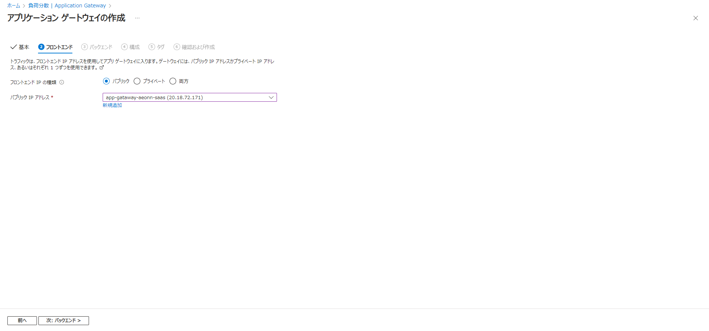
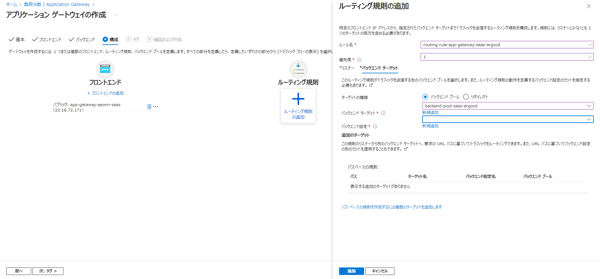
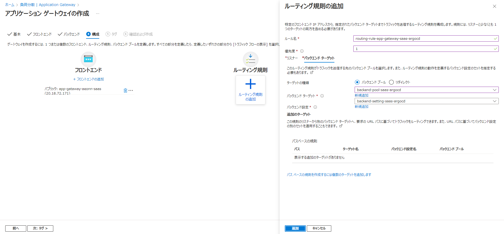
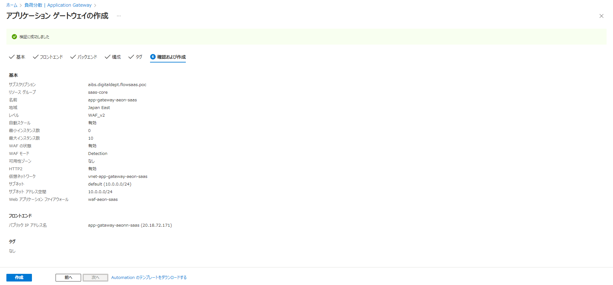

Azure Application Gateway利用ガイド
---
### 目録
- [概要](#概要)
- [WAFの作成](#WAFの作成)
- [仮想ネットワークの作成](#仮想ネットワークの作成)
- [AzureApplicationGatewayの作成](#AzureApplicationGatewayの作成)
- [検証](#検証)
### 概要
Azure Application Gateway は、Web アプリケーションに対するトラフィックを管理できる Web トラフィック (OSI レイヤー 7) ロード バランサーです。 
従来のロード バランサーはトランスポート レイヤー (OSI レイヤー 4 - TCP と UDP) で動作し、 
送信元 IP アドレスとポートに基づくトラフィックを送信先 IP アドレスとポートにルーティングします。
### WAFの作成
Azure Application Gatewayを作成する時にWAFが必要があるため、まずはWAFを作成する
- アジュールポータルで「Web Application Firewall ポリシー (WAF)」を開い、「作成」をクリックする

- 各入力項目を入力し、「確認および作成」をクリックする

- 内容を確認し、「作成」をクリックする

- 以下の画面が出たら、ＯＫ

### 仮想ネットワークの作成
Azure Application Gatewayを作成する時に仮想ネットワークも必要があるため、仮想ネットワークも事前に作成する
- アジュールポータルで「仮想ネットワーク」を開い、「作成」をクリックする

- 各入力項目を入力し、「確認 + 作成」をクリックする

- 内容を確認し、「作成」をクリックする

- 以下の画面が出たら、ＯＫ

### AzureApplicationGatewayの作成
- アジュールポータルで「負荷分散」 の 「Application Gateway」を開い、「作成」をクリックする

- 各入力項目を入力し、「次：フロントエンド」をクリックする

- 事前用意したIPを選択し、「次：バックエンド」をクリックする 
※IP用意しなければ、新規追加必要がある

- 「バックエンド プールの追加」をクリックし、右側の各入力項目を入力し、「追加」をクリックする 

- 「次：構成」をクリックする

- 「ルーティング規則」をクリックする

- 各入力項目を入力し、「バックエンドターゲット」をクリックする

- バックエンドを選択し、「バックエンド設定」の「新規追加」をクリックする

- 各入力項目を入力し、「追加」をクリックする

- 「追加」をクリックする

- 「次：タグ」をクリックする

- 「次：確認および作成」をクリックする

- 検証は成功したら、「作成」をクリックする

- 以下の画面が出たら、ＯＫ

### 検証
ルーティング規則の「バックエンドターゲット」で設定されたホスト名をアクセスし、 
バックエンドのアプリが正常に表示されたら、OK 
※今回の例はhttps://gataway.thomaszou2077.com/⇒https://argocd.thomaszou2077.com/

