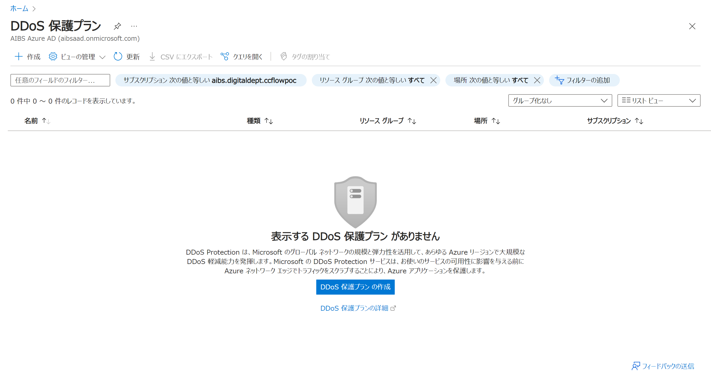
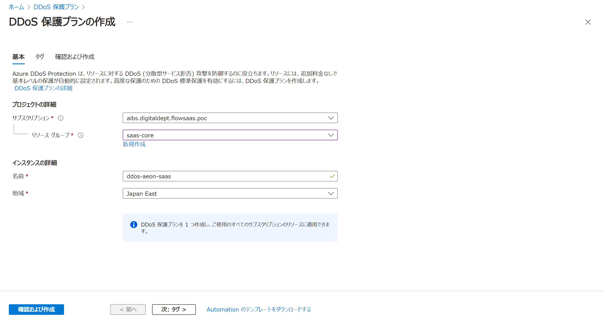
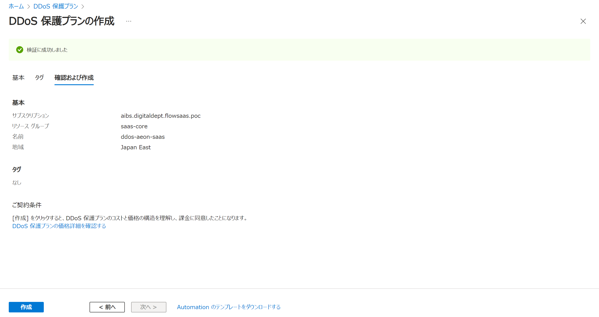
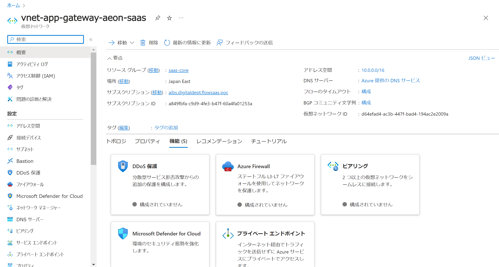
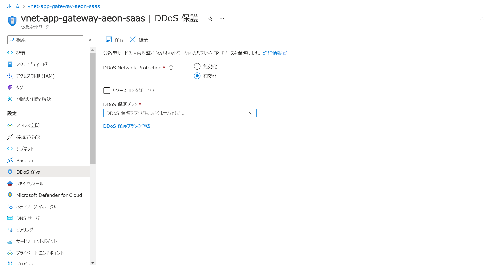

Azure Application Gateway利用ガイド
---
### 目録
- [概要](#概要)
- [DDoS保護プランの作成](#DDoS保護プランの作成)
- [DDoS保護プランの適用](#DDoS保護プランの適用)
- [検証](#検証)
### 概要
Azure DDoS Protection は、アプリケーションの設計に関するベスト プラクティスと組み合わせることにより 
DDoS 攻撃から保護するための強化された DDoS 軽減機能が提供されます。 
この機能は、仮想ネットワーク内にあるお客様固有の Azure リソースを保護するために、自動的に調整されます。 
保護は新規または既存の仮想ネットワークで簡単に有効にでき、アプリケーションやリソースの変更は必要ありません。
### DDoS保護プランの作成
- アジュールポータルで「DDoS 保護プラン」を開い、「作成」をクリックする

- 各入力項目を入力し、「確認および作成」をクリックする

- 内容を確認し、検証は成功したら、「作成」をクリックする

### DDoS保護プランの適用
- アジュールポータルで目標仮想ネットワークを開い、「DDoS保護」をクリックする

- DDoS Network Protectionを有効に選択し、作成されたDDoS保護プランを選択して、保存をクリックする
