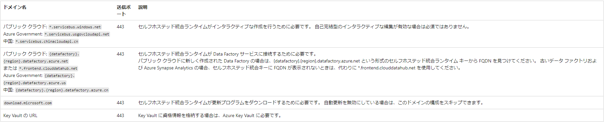

# 1. ADFでデータ統合

## 1.1. 概要

　データベースがAzure SQL DatabaseからTiDBに変更される過程で、データ移行に関する課題が発生すると想定しています。本書では、Azure Data Factory（ADF）を使用してデータ移行の問題を解決する方法について検討します。

※ TiDBのデータエンジンはMySQLと類似しているため、本書で言及されているMySQLの記述はTiDBと同等と見なすことができます。

## 1.2. 統合ランタイムの選択

参照資料：[サポートされるデータ ストアと形式](https://learn.microsoft.com/ja-jp/azure/data-factory/copy-activity-overview#supported-data-stores-and-formats)

### 1.2.1. TiDBの利用可能な統合ランタイムの確認


Azure SQL DatabaseからTiDBにデータを移行することが目的です。ただし、上記の表からわかるように、データストア「MySQL」はシンクとしてサポートされていません。そのため、ADFでTiDBのLinkServiceを作成する際、MySQLコネクタを使用することはできません。さらに、ADFは現在TiDBをサポートしていないため、一般的なコネクタ「汎用ODBC」を使用するしかありません。
そのため、統合ランタイムにセルフホステッドIR(SHIR)を選択することにします。

## 1.3. セルフホステッドIRの用意

参照資料：[セルフホステッド統合ランタイムを作成して構成する](https://learn.microsoft.com/ja-jp/azure/data-factory/create-self-hosted-integration-runtime?tabs=data-factory)

※ TiDBへの接続はVisualC++の再配布可能パッケージ及びMySQLコネクターのインストールが必要です。(
[Installing MySQL Connector/ODBC on Windows](https://dev.mysql.com/doc/connector-odbc/en/connector-odbc-installation-binary-windows.html))

### 1.3.1. コピーするデータ フロー手順の概要


### 1.3.2. ポートとファイアウォール

#### 1.3.2.1. Inbound(データストア)

セルフホステッド統合ランタイムを使用するので、Inbound IPアドレスはホスト(VM)のIPアドレスです。

※Azure　VMの場合、Azureポータルから確認できます

#### 1.3.2.2. Outbound(ADF)

考慮すべきファイアウォールが 2 つあります。

* 組織の中央ルーターで実行されている "企業ファイアウォール"
* セルフホステッド統合ランタイムがインストールされているローカル コンピューターでデーモンとして実行されている "Windows ファイアウォール"


企業ファイアウォール レベルでは、次のドメインと送信ポートを構成する必要があります。



 ※ **\*.servicebus.windows.net**を許可せずに、より具体的な URL を使用する必要がある場合は、セルフホステッド統合ランタイムに必要なすべての FQDN をサービス ポータルから確認できます。 次の手順のようにします。


Windows ファイアウォール レベル (コンピューター レベル) では、通常、これらの送信ポートが有効になっています。 有効になっていない場合は、セルフホステッド統合ランタイム コンピューターで、ドメインとポートを構成することができます。

※ お使いのソースやシンクに基づいて、追加のドメインと送信ポートを企業ファイアウォールまたは Windows ファイアウォールで許可しなければならない場合があります。

## 1.4. セルフホステッド統合ランタイムを作成して構成する

### 1.4.1. 前提条件

* セルフホステッド統合ランタイムには、.NET Framework 4.7.2 以降を含む 64 ビット オペレーティング システムが必要です
* オペレーティング システムからソースデータストアとシンクデータストアと両方へ通信できます
* セルフホステッド統合ランタイム コンピューターに推奨される最小構成は、4 コアの 2 GHz プロセッサ、8 GB の RAM、および 80 GB の使用可能なハード ドライブ領域です
* サポートされている Windows のバージョンは次のとおりです
  * Windows 8.1
  * Windows 10
  * Windows 11
  * Windows Server 2012
  * Windows Server 2012 R2
  * Windows Server 2016
  * Windows Server 2019
  * Windows Server 2022

### 1.4.2. セットアップ

具体的な設定手順は右記の公式サイトをご参照ください。 ([セットアップ手順](https://learn.microsoft.com/ja-jp/azure/data-factory/create-self-hosted-integration-runtime?tabs=data-factory#setting-up-a-self-hosted-integration-runtime))

### 1.4.3. RestAPIよりVMの起動、停止(Azure VMのみ)

### 1.4.3.1. VMのアクセス制御

* ロール割り当ての追加


* 仮想マシン共同作成者の選択


* 対象ADFの選択(ADFより制御の場合)


### 1.4.3.2. VMのステータス確認

参照サイト：[Virtual Machines - Instance View](https://learn.microsoft.com/ja-jp/rest/api/compute/virtual-machines/instance-view?view=rest-compute-2023-10-02&tabs=HTTP)

```HTTP
GET https://management.azure.com/subscriptions/{subscriptionId}/resourceGroups/{resourceGroupName}/providers/Microsoft.Compute/virtualMachines/{vmName}/instanceView?api-version=2023-09-01
```

### 1.4.3.3. VMの起動

参照サイト：[Virtual Machines - Start](https://learn.microsoft.com/ja-jp/rest/api/compute/virtual-machines/start?view=rest-compute-2023-10-02&tabs=HTTP)

```HTTP
POST https://management.azure.com/subscriptions/{subscriptionId}/resourceGroups/{resourceGroupName}/providers/Microsoft.Compute/virtualMachines/{vmName}/start?api-version=2023-09-01
```

### 1.4.3.4. VMの割り当て解除

参照サイト：[Virtual Machines - Deallocate](https://learn.microsoft.com/ja-jp/rest/api/compute/virtual-machines/deallocate?view=rest-compute-2023-10-02&tabs=HTTP)

```HTTP
POST https://management.azure.com/subscriptions/{subscriptionId}/resourceGroups/{resourceGroupName}/providers/Microsoft.Compute/virtualMachines/{vmName}/start?api-version=2023-09-01
```

### 1.4.3.4. 例

テンプレートファイルは「pipleline/TriggerVM.json」をご参照ください。


## 1.5. セルフホステッド統合ランタイムのインストールの自動化

参照資料：[ローカル PowerShell スクリプトを使用したセルフホステッド統合ランタイムのインストールの自動化](https://learn.microsoft.com/ja-jp/azure/data-factory/self-hosted-integration-runtime-automation-scripts)

### 1.5.1. 前提条件

* ローカル コンピューターで PowerShell を起動します。 スクリプトを実行するには、[**管理者として実行**] を選択する必要があります。
* セルフホステッド統合ランタイム ソフトウェアを[ダウンロード](https://www.microsoft.com/ja-jp/download/details.aspx?id=39717)します。 ダウンロードしたファイルのパスをコピーします。
* セルフホステッド統合ランタイムを登録するには**認証キー**も必要です。
* 手動更新を自動化するには、事前に構成されたセルフホステッド統合ランタイムが必要です。

### 1.5.2. 使用例

1.上記のダウンロードされた SHIR MSI (インストール ファイル) のパスを指定します。 たとえば、パスが C:\Users\username\Downloads\IntegrationRuntime_4.7.7368.1.msi の場合、次の PowerShell コマンドライン例をこのタスクに使用できます。

```PowerShell
PS C:\windows\system32> C:\Users\username\Desktop\InstallGatewayOnLocalMachine.ps1 -path "C:\Users\username\Downloads\IntegrationRuntime_4.7.7368.1.msi" -authKey "[key]"
```

2.インストールとキーの登録が完了すると、"Succeed to install gateway(ゲートウェイのインストールに成功) " と "Succeed to register gateway(ゲートウェイの登録に成功) " の結果が、ローカルの PowerShell に表示されます。


## 1.6. セルフホステッド統合ランタイムのコンテナー化

参照資料：[Windows コンテナーでセルフホステッド統合ランタイムを実行する方法
](https://learn.microsoft.com/ja-jp/azure/data-factory/how-to-run-self-hosted-integration-runtime-in-windows-container)

※イメージのビルドについて、親フォルダーの配下にある「adf-shir-in-win-container」を利用してください。(MySQLのODBCドライバーのインストール処理を追加したので)

## 1.7. コピー アクティビティのパフォーマンス

参照資料：[コピー アクティビティのパフォーマンスとスケーラビリティに関するガイド](https://learn.microsoft.com/ja-jp/azure/data-factory/copy-activity-performance)

### 1.7.1. セルフホステッド統合ランタイムのスケーラビリティ

より高いスループットを実現するには、セルフホステッド IR をスケールアップするかスケールアウトします。

* セルフホステッド IR ノード上の CPU と使用可能なメモリが十分に活用されていないにもかかわらず、同時ジョブの実行が上限に達する場合は、ノードで実行できる同時実行ジョブの数を増やすことでスケールアップを行う必要があります。 手順については、次の手順を参照してください。

```Text
プロセッサと使用可能な RAM はあまり使用されていないが、同時実行ジョブの実行がノードの制限に達した場合は、1 つのノードが実行できる同時実行ジョブの数を増やしてスケールアップします。 また、セルフホステッド IR が過負荷になっているために、アクティビティがタイムアウトになる場合も、スケールアップが必要になることがあります。 次の画像に示すように、ノードの最大容量を増やすことができます。
```


* 一方、セルフホステッド IR ノードの CPU が高いか、使用可能なメモリが少ない場合は、新しいノードを追加して、複数のノード間で負荷をスケールアウトすることができます。

### 1.7.2. 並列コピー

Copy アクティビティで並列コピー (Copy アクティビティの JSON 定義の parallelCopies プロパティ、またはユーザー インターフェイスの Copy アクティビティのプロパティの [設定] タブにある Degree of parallelism 設定) を設定し、使用する並列処理を指示できます。 このプロパティは、並列でソースから読み取る、またはシンク データ ストアに書き込むコピー アクティビティ内の最大スレッド数と見なすことができます。


## 1.8. セルフホステッド統合ランタイムのリソースモニター

詳細は次の手順のようにします。

## 1.8.1. Azure portal

１．モニターの統合ランタイムを選択して対象のセルフホステッドをクリックします


２．対象のセルフホステッドの詳細情報が確認できます


## 1.8.2. Azure CLI

参照資料：[統合ランタイムの詳細な状態情報取得](https://learn.microsoft.com/ja-jp/cli/azure/datafactory/integration-runtime?view=azure-cli-latest#az-datafactory-integration-runtime-get-status)

```PowerShell
az datafactory integration-runtime get-status --factory-name "exampleFactoryName" --name "exampleIntegrationRuntime" --resource-group "exampleResourceGroup"
```

## 1.8.3. REST API

参照資料：[Integration Runtimes - Get Status](https://learn.microsoft.com/ja-jp/rest/api/datafactory/integration-runtimes/get-status?view=rest-datafactory-2018-06-01&tabs=HTTP)

```HTTP
POST https://management.azure.com/subscriptions/{subscriptionId}/resourceGroups/{resourceGroupName}/providers/Microsoft.DataFactory/factories/{factoryName}/integrationRuntimes/{integrationRuntimeName}/getStatus?api-version=2018-06-01
```

## 1.9. 運用

## 1.9.1. パイプラインのエクスポート


## 1.9.2. パイプラインのインポート


<style>
p:has(> img){
    display: grid;
}
</style>
