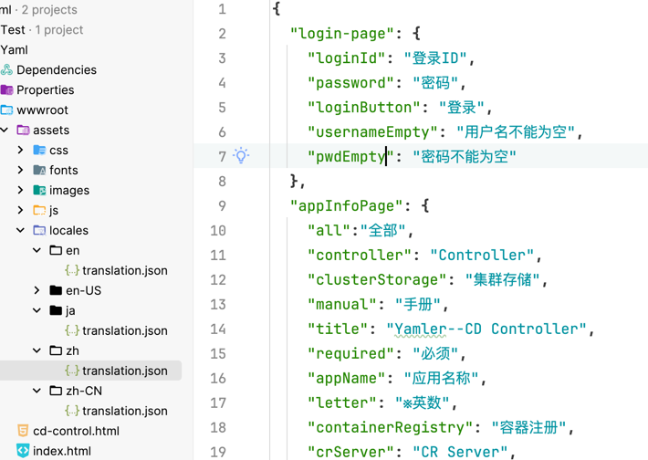
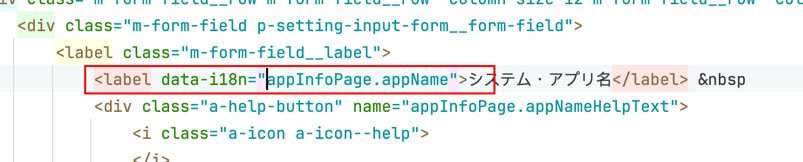

# CCFlow国际化实现
### 前言
通过第三方插件[i8next](https://www.i18next.com/)实现国际化需求，详情请浏览插件的主业，我们的项目主要是jquery，所以要用到其jquery 插件
### 1. 引入依赖
- 在对应html界面引入i8next的js依赖
```javascript
<!-- translation tool -->
<script src="https://cdn.jsdelivr.net/npm/i18next@21.6.10/i18next.min.js"></script>
<script src="https://cdn.jsdelivr.net/npm/jquery-i18next@1.2.1/jquery-i18next.min.js"></script>
<script src="https://cdn.jsdelivr.net/npm/i18next-browser-languagedetector@6.1.3/i18nextBrowserLanguageDetector.min.js"></script>
<script src="https://cdn.jsdelivr.net/npm/i18next-http-backend@1.3.2/i18nextHttpBackend.min.js"></script>
```
### 2. 编写i8next的配置文件
- 引入依赖后我们要编写i18配置js文件 如下所示
```javascript
// 对应的国际化语言
const lngs = {
    'ja': {nativeName: '日本語'},
    'en': {nativeName: 'English'},
    'zh': {nativeName: '中文'},
};
// $('body').localize();是让我们的翻译文本生效
// 这里讲起封装起来 提供给外部使用
const render = () => {
    // start localizing, details:
    $('body').localize();
}
// 初始化插件
const initI18next = function () {
    return i18next
        .use(i18nextHttpBackend)
        .init({
            debug: true,
            lng: 'ja',
            fallbackLng: 'ja',
            backend: {
                loadPath: '/assets/locales/{{lng}}/{{ns}}.json'
            },
        }, (err, t) => {
            if (err) return console.error(err);
            console.log("init i18")
            // for options see
            jqueryI18next.init(i18next, $, {useOptionsAttr: true});

            // fill language switcher
            Object.keys(lngs).map((lng) => {
                const opt = new Option(lngs[lng].nativeName, lng);
                if (lng === i18next.resolvedLanguage) {
                    opt.setAttribute("selected", "selected");
                }
                $('#languageSwitcher').append(opt);
            });
            render();
        })
}
```
- 3. 编写对应的翻译json文本

### 在项目中使用
- 在jquery页面初始化函数中使用
```javascript
$(function () {

    new Promise((resolve) => {
        resolve(initI18next());
    }).then(function () {
        controllerComponent.bindEvents();
        controllerComponent.bindValidation(i18next);
    });
```
- 在 对应的标签内加上i18next的标注

- 如何获取翻译文本
```javascript
const appName = $i18next.t('appInfoPage.appName')
```
- 如何设置翻译 比如点击按钮切换语言
```javascript
// 假设我们有一个下拉框 它的id是languageSwitcher
$('#languageSwitcher').change((a, b, c) => {
    const chosenLng = $(this).find("option:selected").attr('value');
    i18next.changeLanguage(chosenLng, () => {
        // 刷新界面
        render();
    });
});
```