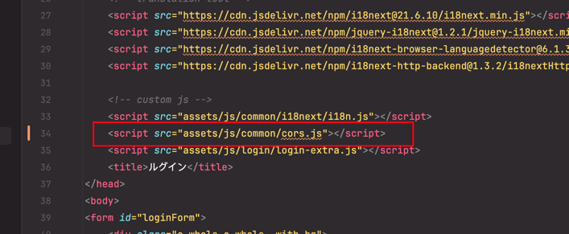

# CCFlowAPI的跨域请求
服务之间的跨域请求比较常见 此处我使用的是[Axios](https://axios-http.com/)，目前的跨域请求还没有认证，
如果我们的项目是纯后台项目的话，放在服务的内网可以不用设置认证，如果有外部访问，那么需要设置认证
### 1.下载cros.js
下载cros.js并引入到本地的前端项目[cors.js](./img/cors.js)，保证项目能访问到并且路径正确

### 2. 项目中的使用
比如当点击按钮发出请求的场景
```javascript
// 按钮click事件 GET请求
$("#cors-test").click(function () {
    // accountId 实际上是不同数据库的schema
    // "http://localhost:50000/api/v1/masterUser?pageSize=100&currentPage=1" 是我们swagger页面的请求链接
    sendRequest('accountId').get("http://localhost:50000/api/v1/masterUser?pageSize=100&currentPage=1")
        .then(function (response) {
            // 操作成功的处理
            console.log(response)
        }).catch(function (error) {
            // 操作失败的处理
            console.log(error)
    })
})

// POST请求
$("#cors-test").click(function () {
    // accountId 实际上是不同数据库的schema
    // "http://localhost:50000/api/v1/masterUser?pageSize=100&currentPage=1" 是我们swagger页面的请求链接
    sendRequest('accountId').get(
        "http://localhost:50000/api/v1/masterUser?pageSize=100&currentPage=1", 
        JsonData // 这里是post的request body 比如 {"userName": "LiYang", "userId":123}
    )
        .then(function (response) {
            // 操作成功的处理
            console.log(response)
        }).catch(function (error) {
        // 操作失败的处理
        console.log(error)
    })
})
```
