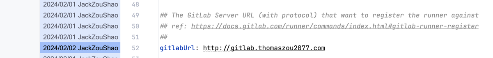
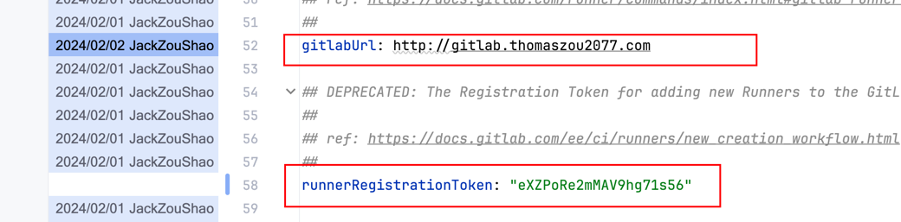
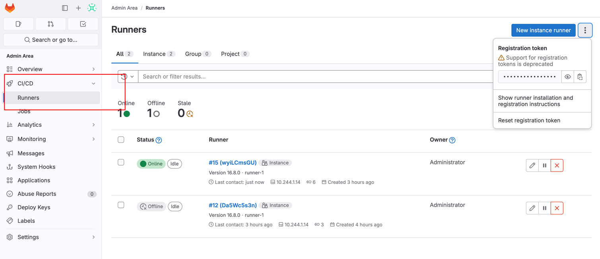
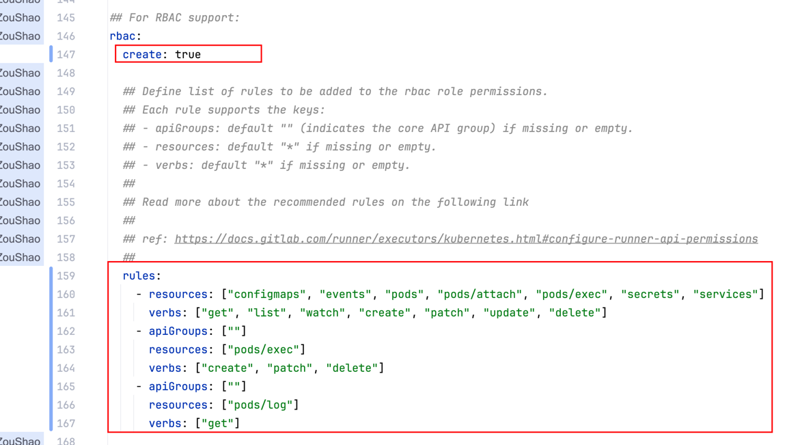
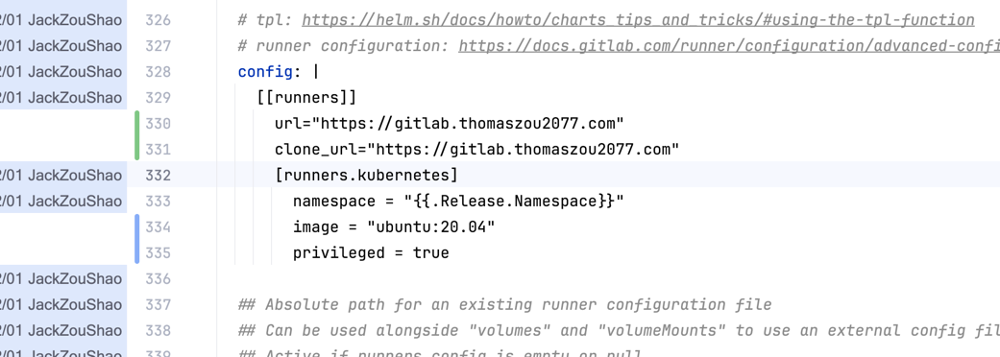
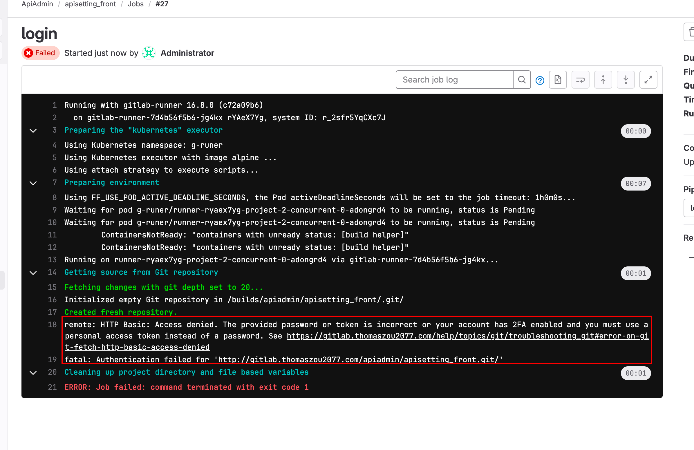
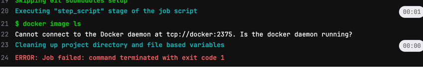
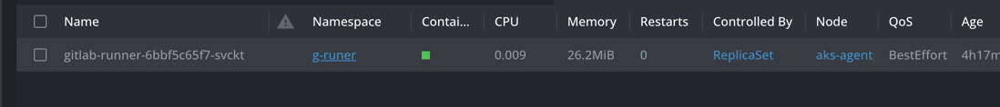
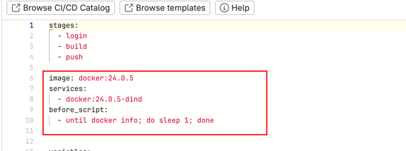

# 在K8s中安装 Gitlab-Runner  (Helm)
---
 [安装参考文档](https://docs.gitlab.com/runner/install/kubernetes.html)
### 目录
- [Lens的安装](#1.Helm 准备)
- [Lens的使用](#Lens的使用)
- [总结](#总结)
### Gitlab Runner简介

GitHub Actions 的一部分，GitHub Runner 是一个应用程序，用于自动执行你的 CI/CD 管道中定义的作业。它可以在任何有网络连接的机器上安装运行，包括你的本地机器、云服务器或者 GitHub 托管的虚拟环境。
这意味着你可以在几乎任何环境中自动化构建、测试和部署你的代码。
GitHub 提供了托管的 Runners，但你也可以设置自己的自托管 Runners 来满足特定的运行环境需求或安全策略。
## 步骤
### 1.Helm相关安装准备
确保您已经安装了 Helm 客户端。如果没有安装，您可以按照 Helm 官方文档的指示进行安装：https://helm.sh/docs/intro/install/

### 1.1 添加 GitLab Runner Helm 仓库：
通过下面的指令下载`helm chart` 到本地
```
helm repo add gitlab http://charts.gitlab.io/
```
然后下载gitlab的helm的`value.yaml`
### 1.2 修改helm的`value.yaml`配置

#### 1.2.1 修改`gitlab url` 和 `registerToken`用来向Gitlab注册Runner
  


其中`registerToken`在Gitlab管理员`Runner`界面下获取


#### 1.2.2 修改 Gitlab Runner 的 k8s权限
因为Gitlab Runner在执行job的时候 实际上会创建一个Pod来运行job 所以我们要设置RBAC 给Gitlab Runner 这个权限
  

#### 1.2.3 修改 certification email  
这个email 的作用主要作用是当域名过期的时候进行提醒 并没有其他作用 一般是填申请域名时的附带的邮箱 或者自己的邮箱也行
  

#### 1.2.4 设置 gitlab runner false
设置为false 主要是因为我们单独配置`gitlab runner` 所以在安装Gitlab的时候不装它


#### 1.2.5 设置 gitlab runner 启动后参数

```yaml
runners:
   config: |
    [[runners]]
      url="https://gitlab.thomaszou2077.com" 
      clone_url="https://gitlab.thomaszou2077.com"
      [runners.kubernetes]
        namespace = "{{.Release.Namespace}}"
        image = "ubuntu:20.04" 
        privileged = true
```
- url 和 clone_url 主要是为了在Gitlab-Runner拉代码的时候给Runner提供正确的仓库地址否则会报git clone 权限不足异常

- `image = "ubuntu:20.04"`指定Runner创建的系统的镜像系统版本，和`privileged = true`是给Gitlab Runner生成的Pod中运行Docker守护进程的权限，这个可以参考 [Docker-in-Docker with TLS disabled in Kubernetes](https://docs.gitlab.com/ee/ci/docker/using_docker_build.html#docker-in-docker-with-tls-disabled-in-kubernetes)
。如果不设置 会出现下面的错误

### 2 执行安装  
在 AKS 上创建一个新的命名空间，以便将 GitLab Runner部署隔离开来。您可以使用以下命令：
```shell
kubectl create namespace gitlab-runner
```
然后执行安装命令
```shell
helm install gitlab-runner gitlab/gitlab-runner -f values-gitlab-runner.yaml --namespace gitlab-runner
```
最后在Lens中查看安装结果 并进行测试

### 3 执行流水线
执行流水线，特别是CI的时候，Runner 生成的Pod需要创建Docker的Daemon，这个时候我们需要在gitlab-ci.yaml做出如下配置

```yaml
image: docker:24.0.5 #  docker 镜像
services:
  - docker:24.0.5-dind # docker 的守护进程
before_script:
  #  作用是保证docker daemon进程启动后才执行 `docker info`指令，不然会报错
  # `Cannot connect to the Docker daemon at unix:///var/run/docker.sock. Is the docker daemon running?`
  - until docker info; do sleep 1; done
```
- `docker-dind`是 docker 的守护进程
- `until docker info; do sleep 1; done` 作用是保证docker daemon进程启动后才执行 `docker info`指令，不然会报错
`Cannot connect to the Docker daemon at unix:///var/run/docker.sock. Is the docker daemon running?`

