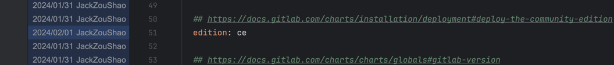
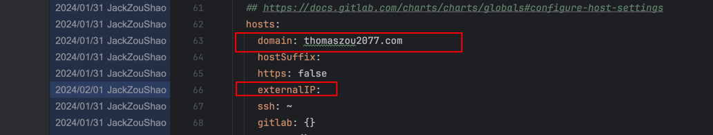
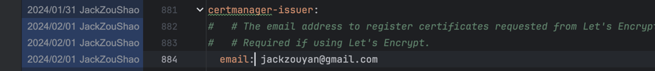
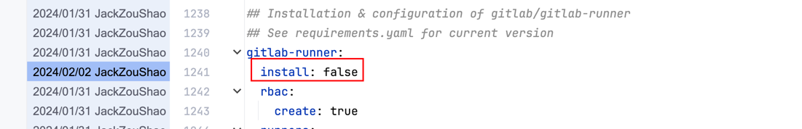
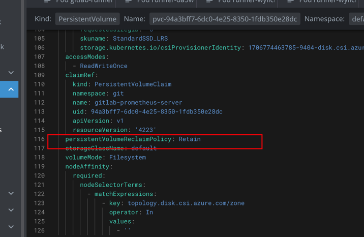
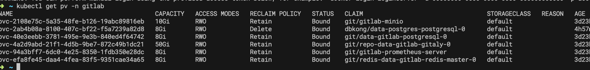

# 在K8s中安装 Gitlab  (Helm)
---
### 目录
- [Lens的安装](#1.Helm 准备)
- [Lens的使用](#Lens的使用)
- [总结](#总结)
### Gitlab简介
GitLab 是一个开源的 DevOps 平台，提供从项目规划、源代码管理到 CI/CD、监控和安全的一体化解决方案。GitLab 支持协作式软件开发，使团队能够高效地在同一个平台上管理整个软件开发生命周期。它的特点包括内置的持续集成和持续部署服务，允许自动化测试、构建和部署代码。GitLab 适用于任何规模的团队，可以部署在云端或自托管环境中，支持多种编程语言和框架。  
Azure是微软的云服务工具 本期我们将讨论用Azure 的K8s组件 AKS 搭建Gitlab-CE。在 Azure Kubernetes Service (AKS) 上安装 GitLab 可以通过以下步骤实现。 在这个过程中，我们将使用 Helm Chart 来部署 GitLab。
## 步骤
### 1.Helm相关安装准备
确保您已经安装了 Helm 客户端。如果没有安装，您可以按照 Helm 官方文档的指示进行安装：https://helm.sh/docs/intro/install/
### 1.1 添加 GitLab Helm 仓库：
通过下面的指令进行安装
```
helm install my-gitlab gitlab/gitlab --version 7.8.1
```
然后下载gitlab的helm的`value.yaml`
### 1.2 修改helm的`value.yaml`配置
#### 1.2.1 修改gitlab版本 中`edition`
  ```javascript
  edition: ce
  ```
  

#### 1.2.2 修改 gitlab url 和 externalIP(如果是固定ip的hx)
  
#### 1.2.3 修改 certification email  
这个email 的作用主要作用是当域名过期的时候进行提醒 并没有其他作用 一般是填申请域名时的附带的邮箱 或者自己的邮箱也行
  
#### 1.2.4 设置 gitlab runner false
设置为false 主要是因为我们单独配置`gitlab runner` 所以在安装Gitlab的时候不装它
#### 1.2.5 设置 内存 cpu 硬盘
设置为false 主要是因为我们单独配置`gitlab runner` 所以在安装Gitlab的时候不装它

### 2 执行安装  
在 AKS 上创建一个新的命名空间，以便将 GitLab 部署隔离开来。您可以使用以下命令：
```shell
kubectl create namespace gitlab
```
然后执行安装命令
```shell
helm install gitlab gitlab/gitlab -f values.yaml --namespace gitlab
```
最后在Lens中查看安装结果
### 3 设置安装后参数
### 3.1 Disk 设置
#### 3.1.1 Disk Size 设置
`repo-data-gitlab-gitaly-0`的配置设置成10Gi

#### 3.1.2 Disk Reclaim Policy 设置
在Lens中设置 PV的 
`persistentVolumeReclaimPolicy: Retain`


### 3.2 Load Balancer 设置


