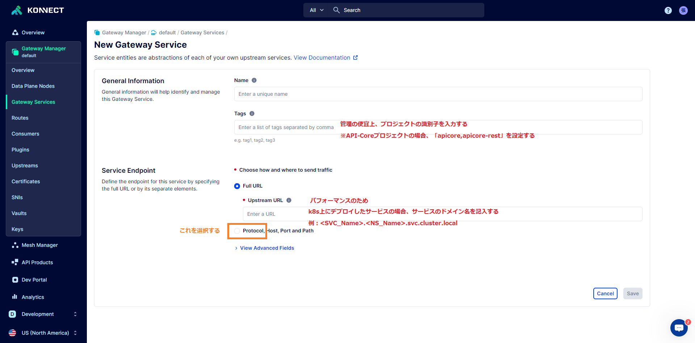
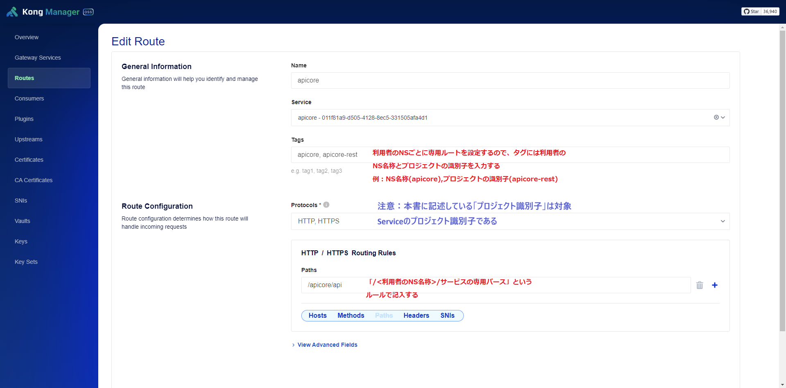

# 1. Kong Gateway

## 1.1. 概要

　Kong Gatewayは、Kong Inc.が提供するソフトウェアで、マイクロサービスと分散アーキテクチャに最適化されたAPIゲートウェイです。オープンソース版と商用版があり、どちらもAPIゲートウェイ機能を持っています。Kong GatewayはAPIのリバースプロキシとして機能し、Webアクセスを受け取り、それをバックエンドのAPI実行サーバーに転送します。これにより、複数のマイクロサービス型のAPI実行サーバーを一元管理することができます。

Kong Gatewayには、認証、アクセス制限、レート制限、監視などの機能があります。また、プラグイン（Kong Plugin Hub）を使用することで、その機能を拡張することができます。

## 1.2. オープンソース版と商用版の比較

参照資料：[Kong Gateway for every stage
of your API journey](https://konghq.com/products/kong-gateway)


## 1.3. 構築(Kubernetes)

参照サイト：[Kong in K8s](https://docs.konghq.com/gateway/3.5.x/install/kubernetes/)

### 1.3.1. Hybrid Modeの構成図


**メリット：**

* 展開の柔軟性： ユーザーは、DPグループごとにローカルクラスタ化データベースを用意することなく、データプレーンのグループを異なるデータセンター、地域、ゾーンに展開できます。
* 信頼性の向上： データベースの可用性がデータプレーンの可用性に影響することはありません。各DPはコントロール・プレーンから受け取った最新のコンフィグレーションをローカルのディスク・ストレージにキャッシュするため、CPノードがダウンしてもDPノードは機能し続けます。
  * CPがダウンしている間、DPノードは常に通信の再確立を試みます。
  * CPがダウンしている間にDPノードを再起動しても、プロキシトラフィックは正常なままです。
* トラフィックの削減： データベースへの直接接続が必要なのはCPノードのみであるため、データベースとのトラフィック量が大幅に削減されます。
* セキュリティの向上： DPノードの1つが侵害されても、攻撃者はKongクラスタの他のノードに影響を与えることができません。
* 管理の容易さ： 管理者はCPノードとやり取りするだけで、Kongクラスタ全体のステータスを制御および監視できます。

**重要：**
Kong クラスターがあるからといって、クライアント トラフィックが Kong ノード間で負荷分散されるわけではありません。トラフィックを分散するために、Kongノードの前にロードバランサーが必要です。代わりに、Kong クラスターは、これらのノードが同じ構成を共有することを意味します。
[What a Kong cluster does and doesn’t do](https://docs.konghq.com/gateway/latest/production/deployment-topologies/traditional/)

### 1.3.2. Hybrid ModeのGateWay構築

### 1.3.2.1. Data Plane Node(DP)の作成(Konnect)

１．[Kong Manager](https://signin.cloud.konghq.com/)へログインします


２．Gateway ManagerからCPを選択します


3．DP作成コードの参照

(1) URL確認


(2) 上記のURLの「overview」を「configuration」に変更します


(3) 「Create a Data Plane Node」から実行コマンドをコピーして環境にて叩きます

### 1.3.2.2. Kubernetesにて構築

参照資料：[Kong for Kubernetes](https://github.com/Kong/charts/blob/main/charts/kong/README.md)

### 1.3.2.2.1. Postgresqlの構築

1.PostgreSQLインストール

```bash
# パスワード、ネームスペースは変更可能
helm install postgres --set auth.postgresPassword=postgres oci://registry-1.docker.io/bitnamicharts/postgresql -n dbkong --create-namespace
```

2.サービス名確認


3.Kong Gateway専用のDB作成

```bash
# 接続先は上記の確認したネームスペース名より組み合わせ
kubectl run postgres-postgresql-client --rm --tty -i --restart='Never' --namespace dbkong --image docker.io/bitnami/postgresql:16.1.0-debian-11-r24 --env="PGPASSWORD=postgres" \
 --command -- psql --host postgres-postgresql -U postgres -d postgres -p 5432

 # PostgreSQLに接続した後、下記のSQLを叩く
 CREATE USER kong WITH PASSWORD 'kong';
 CREATE DATABASE kong OWNER kong;
```

### 1.3.2.2.2. Control Plane Node(CP)の作成(K8S)

```bash
# helmにKongのレポジトリ追加
helm repo add kong https://charts.konghq.com
helm repo update

# CP及びDPの間に通信用の証明書作成
openssl req -new -x509 -nodes -newkey ec:<(openssl ecparam -name secp384r1) \
  -keyout /tmp/cluster.key -out /tmp/cluster.crt \
  -days 3650 -subj "/CN=kong_clustering"

# Kubernetesのシークレットに保管
kubectl create namespace kong
kubectl create secret tls kong-cluster-cert -n kong --cert=/tmp/cluster.crt --key=/tmp/cluster.key

# 本書の親フォルダーの配下にあるvalues/cp-values.yaml利用
helm install kong-cp kong/kong -n kong --values /path-to-file/cp-values.yaml
```

### 1.3.2.2.3. Data Plane Node(DP)の作成(K8S)

```bash
# 本書の親フォルダーの配下にあるvalues/dp-values.yaml利用
helm install kong-dp kong/kong -n kong --values /path-to-file/dp-values.yaml
```

### 1.3.2.2.4. Kong Managerへアクセス

1.Port Forward

```bash
# ホストからAdmin APIのサービスポートとマッピング(ホスト側のポートも8001にしなければいけない)
kubectl port-forward svc/kong-cp-kong-admin 8001:8001 -n kong

# ホストからManagerのサービスポートとマッピング(ホスト側のポートは任意)
kubectl port-forward svc/kong-cp-kong-manager 8002:8002 -n kong
```

2.ブラウザからアクセス

※処理1でマッピングした「Managerのサービスポート」を利用してManagerポータルへサクセスします(上記の場合、「http://localhost:8002」であります)


### 1.3.3. サービス、ルートの登録

Admin APIより：[Services and Routes](https://docs.konghq.com/gateway/3.5.x/get-started/services-and-routes/)

Kong Managerより：[Services and Routes](https://docs.konghq.com/gateway/3.5.x/kong-manager/get-started/services-and-routes/)

**構成図：**


(1) Service設定(業務アプリケーション)


(2) Route設定(アクセスエンドポイント)


### 1.3.4. ルートごとにアクセストークン設定

### 1.3.4.1. プラグイン「JWT」設定

参照資料：[プラグインJWTの概要](https://docs.konghq.com/hub/kong-inc/jwt/)


### 1.3.4.2. Route専用のコンシュマ作成


### 1.3.4.3. コンシュマのクレデンシャル作成


### 1.3.4.4. アクセストークン作成

JWTのオンラインツールを利用してアクセストークンを作成する。　[jwt.io](https://jwt.io/)


### 1.3.4.5. 認証確認


### 1.3.5. Load balancing

Admin APIより：[Load Balancing](https://docs.konghq.com/gateway/3.5.x/get-started/load-balancing/)

Kong Managerより：[Load Balancing](https://docs.konghq.com/gateway/3.5.x/kong-manager/get-started/load-balancing/)

**構成図：**


(1) Load balancingの設定


## 1.4. Firewall

### 1.4.1. コンフィグファイルより

参照サイト：[Firewall](https://docs.konghq.com/gateway/latest/production/networking/firewall/#firewall)

### 1.4.2. IP Restrictionプラグインより

参照サイト：[IP Restriction Configuration](https://docs.konghq.com/hub/kong-inc/ip-restriction/configuration/)

IPアドレスを許可または拒否することで、サービスやルートへのアクセスを制限します。単一のIP、複数のIP、または10.10.10.0/24のようなCIDR表記の範囲を使用できます。

プラグインはIPv4とIPv6アドレスをサポートしています。

## 1.5. CORS

参照サイト：[CORS Configuration](hhttps://docs.konghq.com/hub/kong-inc/cors/configuration/)

CORS（Cross-Origin Resource Sharing）の設定はCORSプラグインを使用して行います。サービスごと、ルートごとまたは全体のCORS設定はできます。

* CORSプラグインの追加


* CORSプラグインの設定

※各項目にはどんな値を設定するのは下記のサイトを参照してください。
[Kong: CORS Configuration](https://docs.konghq.com/hub/kong-inc/cors/configuration/)
[MDN: Cross-Origin Resource Sharing (CORS)](https://developer.mozilla.org/en-US/docs/Web/HTTP/CORS)

<style>
p:has(> img){
    display: grid;
}
</style>
