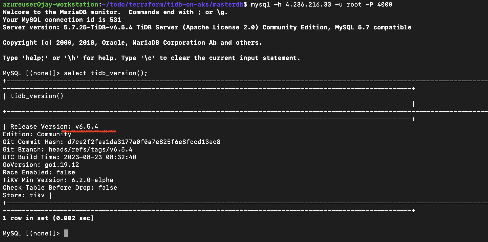
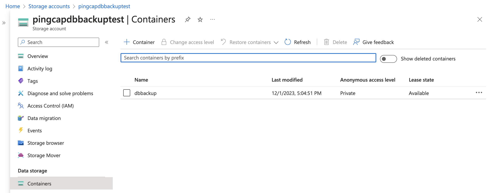
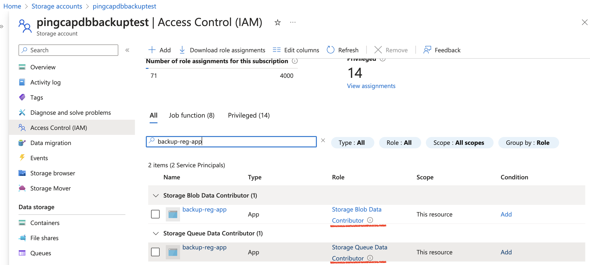
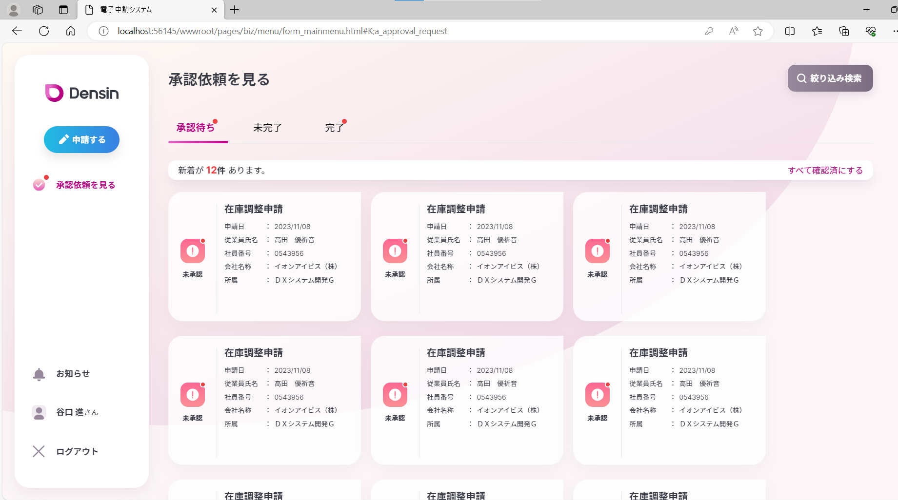

TiDB検証検証報告書
===========================
# 目次
- [TiDB検証目的](#TiDB検証目的)
- [TiDB検証概要](#TiDB検証概要)
- [TiDB検証環境準備](#TiDB検証環境準備)
- [TiDB検証テストデータ準備](#TiDB検証テストデータ準備)
- [TiDBセッキュリティ検証](#TiDBセッキュリティ検証)
- [TiDB性能検証](#TiDB性能検証)
- [DX環境でのTiDBインストール](#DX環境でのTiDBインストール)
## TiDB検証目的
To add
## TiDB検証概要 
TiDB検証の詳細は下表のように纏めました。 
**結論としては、TiDBはAzureクラウドで運用しやすく、大量データを扱う場合でも性能に満足できる製品になります。**
| NO | 検証内容 | 評価結果 | 備考 |
| ---------- | -----------|-----------|-----------|
| 1| TiDBのAzureクラウドインストール検証 | ◎ | Azureクラウドにインストールしたが、DX環境のインストールはまだ検証していない |
| 2| TiDB運用とセッキュリティ検証 | ◎ |  |
| 2.1| Kubunetesバージョンアップ検証 | ◎ | DX基盤ではBlue/Green運用と称する |
| 2.2| データベースバックアップ検証 | ◎ |  |
| 2.3| TiDBバージョンアップ | ◎ |  |
| 2.4| データ保存テスク拡張検証 | ◎ |  |
| 2.5| 安全なDBアクセス方式の確立 | 〇 | サービスプリンシパル方式なし |
| 2.5.1| TiDB 安全な接続| ◎ | TiDB クライアント側の暗号化 |
| 2.5.2| Azure AD authentication | △ | Azure AD authentication サポート対象外 |
| 2.6| 多DBインスタンスの検証 | ◎ | インスタンス毎に細かくリリース振り分けできることを検証する |
| 3| TiDB性能検証 | 〇 | |
| 3.1| 大量データ参照 | ◎ | 三億行ほどのテーブルの参照 |
| 3.2| スケーリングからの性能影響| ◎ | スケーリングアウトとスケーリングアップからサービスに影響が少ない |
| 3.3| OrderBy | 〇 | OrderBy対応に懸念が残ったため(上順と下順の組合せ) 、一重まるを付けることに |

## TiDB検証環境準備

DX環境に検証する前にAzureのインターネット環境にTiDBをインストールし、性能とセッキュリテイ関連の検証を行った。インストール詳細は以下になります。

* Kubernetes　version： 1.25.11
※Blue/Greenプロセスを検証するためにインストール時に低いバージョンを選んだ
以下６Poolをインストール
* Tidb 2Pod
* Tikv 3Pod 各Pod１Ti　SSDテスクを付ける
* Pd    3Pod 
* Ticdc 3Pod
* Tiflash 3Pod
* Admin 1Pod


## TiDB検証テストデータ準備

### テストアプリ
CCFlowのワークフローシステム（SSFlow）のデータベースがSQL　ServerからTiDBに切り替え、テストアプリとして利用する
CCFlowエンジンなどを解析し、データベーステーブルにワークフローデータをインサートしてワークフローの承認関連動作や一覧などを正常に行えることを確認し、大容量テストデータの作成に入る。

### テストデータ
大容量テストデータ作成用のPythonプログラムを開発し、TiDBのAKS内テストデータ作成用POD（8Core,メモリ16Gi）、PODにテストデータ保存用ディスク１Tを付けることに、TiDB Lightningツールを使って1.5億件フロー（3業務フローにそれぞれ5000万件）データを導入した。
以上の1.5億件フローデータの容量は500Gi超になり、TiDBのセッキュリテイ性能を検証するためTiDB全体のボリュームが１Tiの状態でテストしたいと考えて、TiDBに新しいインスタンスを追加し、上記同じ500Giテストデータが新インスタンスにも導入した。

## TiDB運用とセッキュリティ検証
以下の順でKubunetesバージョンアップ、データベースバックアップ、 TiDBバージョンアップ、データ保存テスク拡張、安全なDBアクセス方式の確立、多DBインスタンスの検証を行いました。

### Kubunetesバージョンアップ
KubunetesバージョンアップはよくBlue/Green運用の形で対応していますが、TiDBでは順次にSlave NodeのKubenetesのバージョンアップ完了し、最後Master NodeのKubenetesのバージョンアップを行う形で作業を進めます。下記のダイナミック図のようにPOD別のKubenetesバージョンアップのプロセスより対応することとしています。
  

検証詳細プロセスは以下のようになります。

* Node、Podの現状を確認します。

```
kubectl get nodes
```
  
```
kubectl get tc -n tidb-cluster
```
  
```
kubectl get pod -n tidb-cluster -o wide
```
  

* control plane、PoolのK8Sバージョンを確認します。

```
az aks show --resource-group saas-core --name aeontidb --output table
```
  
```
az aks nodepool list --resource-group saas-core --cluster-name aeontidb --query "[].{Name:name,k8version:orchestratorVersion}" --output table
```
  

* control planeのK8Sバージョンアップを行います。
※バージョン1.25.11は1.26.10など限定バージョンにしかバージョンアップできないようになっていて、ほかのバージョン番号を指定されたら、エラーが発生します。
```
az aks upgrade --resource-group saas-core --name aeontidb --control-plane-only --no-wait --kubernetes-version 1.26.10
```
  

```
az aks show --resource-group saas-core --name aeontidb --output table
```
  

* 新しいtidb Poolを新規作成します。
```
az aks nodepool add --name newtidb --cluster-name aeontidb --resource-group saas-core --node-vm-size Standard_E8s_v4 --zones 1 2 3 --node-count 2 --labels dedicated=tidb --node-taints dedicated=tidb:NoSchedule
```
  
  
* PODを確認します。
```
kubectl get pod -n tidb-cluster -o wide
```
 

* 古いtidb Poolの紐づけを外します。
```
az aks nodepool update --resource-group saas-core --cluster-name aeontidb --name "tidb" --labels="" --node-taints=""
```
 

* tidbのPodを削除します（新Tidb Poolに紐づける新しいPODを自動起動する）。
```
kubectl delete pod basic-tidb-0 -n tidb-cluster
kubectl delete pod basic-tidb-1 -n tidb-cluster
```
 

* 古いtidb Poolを削除します。
```
az aks nodepool delete --name tidb --cluster-name aeontidb --resource-group saas-core
```
 


* Pd,tikvも同じように新規Pool,旧pool関連外し、POD削除などを行います、コマンドは以下になります。
```
az aks nodepool add --name newpd --cluster-name aeontidb --resource-group saas-core --node-vm-size Standard_F4s_v2 --zones 1 2 3 --node-count 3 --labels dedicated=pd --node-taints dedicated=pd:NoSchedule

az aks nodepool add --name newtikv --cluster-name aeontidb --resource-group saas-core --node-vm-size Standard_E8s_v4 --zones 1 2 3 --node-count 3 --labels dedicated=tikv --node-taints dedicated=tikv:NoSchedule

 az aks nodepool update --resource-group saas-core --cluster-name aeontidb --name "pd" --labels="" --node-taints=""
 az aks nodepool update --resource-group saas-core --cluster-name aeontidb --name "tikv" --labels="" --node-taints="“
kubectl delete pod basic-pd-0 -n tidb-cluster
kubectl delete pod basic-pd-1 -n tidb-cluster
kubectl delete pod basic-pd-2 -n tidb-cluster
kubectl delete pod basic-tikv-0 -n tidb-cluster
kubectl delete pod basic-tikv-1 -n tidb-cluster
kubectl delete pod basic-tikv-2 -n tidb-cluster
az aks nodepool delete --name pd --cluster-name aeontidb --resource-group saas-core
az aks nodepool delete --name tikv --cluster-name aeontidb --resource-group saas-core
```
* 新ticdc Poolを作成し、旧ticdc Poolを削除します。
```
az aks nodepool add --name newticdc --cluster-name aeontidb --resource-group saas-core --node-vm-size Standard_E16s_v4 --zones 1 2 3  --node-count 3 --labels dedicated=ticdc --node-taints dedicated=ticdc:NoSchedule
az aks nodepool delete --name ticdc --cluster-name aeontidb --resource-group saas-core
az aks nodepool list --cluster-name aeontidb --resource-group saas-core --output table
```
 

* Master PoolのKubenetesバージョンアップを行います。
```
az aks nodepool upgrade --resource-group saas-core --cluster-name aeontidb --name admin --no-wait --kubernetes-version 1.26.10
```
 

* テストアプリ画面でフローの承認などの作業をし、正常に動作できることが確認できました！
 

### TiDBバージョンアップ
#### バージョンアップ前の確認
* TiDBサービス確認
```
kubectl get service -n tidb-cluster
```


* バージョン確認

#### バージョンアップ実施

* バージョン設定


* バージョンアップ監視


#### バージョンアップ後の確認


### バックアップとリストア検証
#### 事前準備
* アプリの登録
tidb-on-aks$ az ad app create --display-name backup-reg-app
```
{
  "@odata.context": "https://graph.microsoft.com/v1.0/$metadata#applications/$entity",
  "addIns": [],
... ...
    "logoutUrl": null,
    "redirectUriSettings": [],
    "redirectUris": []
  }
}
```

* アプリのsecretの設定
```
tidb-on-aks$ az ad app list --display-name "backup-reg-app" | jq '.[0].appId'
"xxxxxxxx-1234-abcd-xxxx-xxxxxx000001"
tidb-on-aks$  az ad app credential reset --id "xxxxxxxx-1234-abcd-xxxx-xxxxxx000001" --append 
The output includes credentials that you must protect. Be sure that you do not include these credentials in your code or check the credentials into your source control. For more information, see https://aka.ms/azadsp-cli
{
  "appId": "xxxxxxxx-1234-abcd-xxxx-xxxxxx000001",
  "password": "XXxxQ~xxxxxxxxXXXX_~xxxxxxxxxxXXXXXXXX01",
  "tenant": "xxxxxxxx-1234-abcd-xxxx-xxxx00000002"
}
tidb-on-aks$ az ad app credential list --id "xxxxxxxx-1234-abcd-xxxx-xxxxxx000001"
[
  {
    "customKeyIdentifier": null,
    "displayName": null,
    "endDateTime": "2024-12-01T02:40:16Z",
    "hint": "VwR",
    "keyId": "yyyyyyyy-yyyy-yyyy-yyyy-yyyyyyyy0002",
    "secretText": null,
    "startDateTime": "2023-12-01T02:40:16Z"
  }
]
```

* プリンシパル作成
```
tidb-on-aks$ az ad sp create --id 01139ae6-58c7-4a7c-b360-fc8110e13fce
{
  "@odata.context": "https://graph.microsoft.com/v1.0/$metadata#servicePrincipals/$entity",
  "accountEnabled": true,
  "addIns": [],
  "alternativeNames": [],
  ... ...
  "verifiedPublisher": {
    "addedDateTime": null,
    "displayName": null,
    "verifiedPublisherId": null
  }
}
```
* 使用する変数
  変数名 | 例
  --- | ---
  アプリ名 | backup-reg-app
  secret ID | yyyyyyyy-yyyy-yyyy-yyyy-yyyyyyyy0002
  Value | VwRxQ~xxxxxxxxXXXX_~xxxxxxxxxxXXXXXXXX01
  appId(client id) | xxxxxxxx-1234-abcd-xxxx-xxxxxx000001
  tenant | xxxxxxxx-1234-abcd-xxxx-xxxx00000002
#### ストレージ準備
* Azure Storage Account準備
```
tidb-on-aks$ export RESOURCE_GROUP=resource_name_to_deploy
tidb-on-aks$ az storage account create --name pingcapdbbackuptest --resource-group $RESOURCE_GROUP --allow-blob-public-access false --location "East US"
The public access to all blobs or containers in the storage account will be disallowed by default in the future, which means default value for --allow-blob-public-access is still null but will be equivalent to false.
{                         
  "accessTier": "Hot",          
  "allowBlobPublicAccess": false,
  "allowCrossTenantReplication": null,
  "allowSharedKeyAccess": null,
  ... ...
  "tags": {},
  "type": "Microsoft.Storage/storageAccounts"
}
```


* Container準備
```
tidb-on-aks$ az storage container create -n dbbackup --account-name pingcapdbbackuqptest
{
  "created": true
}
```


* REGISTER APP権限付与
リソース | ロール
--- | ---
ストレージアカウント | Storage Blob Data Contributor
ストレージアカウント | Storage Queue Data Contributor
コンテナ |	Contributor
  - ストレージアカウント権限付与
```
tidb-on-aks$ az role assignment create --assignee "xxxxxxxx-1234-abcd-xxxx-xxxxxx000001" --role "Contributor" --scope "/subscriptions/00000000-0000-0000-0000-000000000000/resourceGroups/$RESOURCE_GROUP/providers/Microsoft.Storage/storageAccounts/pingcapdbbackuptest/blobServices/default/containers/dbbackup"
{
  "condition": null,
  "conditionVersion": null,
  "createdBy": null,
  "createdOn": "2023-12-01T08:29:10.402947+00:00",
  "delegatedManagedIdentityResourceId": null,
  "description": null,
  "id": "/subscriptions/00000000-0000-0000-0000-000000000000/resourceGroups/$RESOURCE_GROUP/providers/Microsoft.Storage/storageAccounts/pingcapdbbackuptest/blobServices/default/containers/dbbackup",
  ... ...
}
tidb-on-aks$ az role assignment create --assignee "xxxxxxxx-1234-abcd-xxxx-xxxxxx000001" --role "Storage Blob Data Contributor" --scope "/subscriptions/00000000-0000-0000-0000-000000000000/resourceGroups/$RESOUIRCE_GROUP/providers/Microsoft.Storage/storageAccounts/pingcapdbbackuptest"
{
  "condition": null,
  "conditionVersion": null,
  "createdBy": null,
  "createdOn": "2023-12-01T14:16:26.166195+00:00",
  "delegatedManagedIdentityResourceId": null,
  "description": null,
  "id": "/subscriptions/00000000-0000-0000-0000-000000000000/resourceGroups/$RESOURCE_GROUP/providers/Microsoft.Storage/storageAccounts/pingcapdbbackuptest/providers/Microsoft.Authorization/roleAssignments/22f1ac17-572c-4a57-a5cd-143b033f13ba",
  ... ...
}
```
    
  - コンテナ権限付与
    ```
tidb-on-aks$ az role assignment create --assignee "xxxxxxxx-1234-abcd-xxxx-xxxxxx000001" --role "Storage Queue Data Contributor" --scope "/subscriptions/00000000-0000-0000-0000-000000000000/resourceGroups/$RESOURCE_GROUP/providers/Microsoft.Storage/storageAccounts/pingcapdbbackuptest/blobServices/default/containers/dbbackup"
{
  "condition": null,
  "conditionVersion": null,
  "createdBy": null,
  "createdOn": "2023-12-01T14:21:06.453272+00:00",
  "delegatedManagedIdentityResourceId": null,
  "description": null,
  ... ...
}

    ```
    
#### kubernetesにクレデンシャル格納
* kubernetesにクレデンシャル格納
     ```
tidb-on-aks$ export AZURE_STORAGE_ACCOUNT=pingcapdbbackuqptest
tidb-on-aks$ export AZURE_CLIENT_ID=xxxxxxxx-1234-abcd-xxxx-xxxxxx000001
tidb-on-aks$ export AD_TENANT_ID=xxxxxxxx-1234-abcd-xxxx-xxxx00000002
tidb-on-aks$ export SECRET_VALUE=VwRxQ~xxxxxxxxXXXX_~xxxxxxxxxxXXXXXXXX01
tidb-on-aks$ kubectl create namespace backup-test
tidb-on-aks$ kubectl create secret generic azblob-secret-ad --from-literal=AZURE_STORAGE_ACCOUNT=${AZURE_STORAGE_ACCOUNT} --from-literal=AZURE_CLIENT_ID=${AZURE_CLIENT_ID} --from-literal=AZURE_TENANT_ID=${AD_TENANT_ID} --from-literal=AZURE_CLIENT_SECRET=${SECRET_VALUE} --namespace=backup-test
tidb-on-aks$ kubectl create secret generic azblob-secret-ad --from-literal=AZURE_STORAGE_ACCOUNT=${AZURE_STORAGE_ACCOUNT} --from-literal=AZURE_CLIENT_ID=${AZURE_CLIENT_ID} --from-literal=AZURE_TENANT_ID=${AD_TENANT_ID} --from-literal=AZURE_CLIENT_SECRET=${SECRET_VALUE} --namespace=tidb-cluster
     ```
* サービスアカウント作成
バックアップとリストア用のサービスアカウント作成。[リンクファイル](https://github.com/pingcap/tidb-operator/blob/v1.5.1/manifests/backup/backup-rbac.yaml)をダウンロードして、Kubernetesにサービスアカウントを作成すること。
    ```
tidb-on-aks$ more backup-rbac.yaml
---
kind: Role
apiVersion: rbac.authorization.k8s.io/v1
metadata:
  name: tidb-backup-manager
  labels:
    app.kubernetes.io/component: tidb-backup-manager
rules:
- apiGroups: [""]
  resources: ["events"]
  verbs: ["*"]
- apiGroups: ["pingcap.com"]
  resources: ["backups", "restores"]
  verbs: ["get", "watch", "list", "update"]

---
kind: ServiceAccount
apiVersion: v1
metadata:
  name: tidb-backup-manager

---
kind: RoleBinding
apiVersion: rbac.authorization.k8s.io/v1
metadata:
  name: tidb-backup-manager
  labels:
    app.kubernetes.io/component: tidb-backup-manager
subjects:
- kind: ServiceAccount
  name: tidb-backup-manager
roleRef:
  apiGroup: rbac.authorization.k8s.io
  kind: Role
  name: tidb-backup-manager

tidb-on-aks$ # The rbac is created after the namespace of backup-test is created
tidb-on-aks$ kubectl create -f backup-rbac.yaml -n backup-test
role.rbac.authorization.k8s.io/tidb-backup-manager created
serviceaccount/tidb-backup-manager created
rolebinding.rbac.authorization.k8s.io/tidb-backup-manager created

tidb-on-aks$ # The rbac is created after the namespace of restore-test is created
tidb-on-aks$ kubectl create -f backup-rbac.yaml -n restore-test
role.rbac.authorization.k8s.io/tidb-backup-manager created
serviceaccount/tidb-backup-manager created
rolebinding.rbac.authorization.k8s.io/tidb-backup-manager created
    ```
* クレデンシャルをTiDB Clusterにパッチ
TiDBクラスターのTiKVノードからストレージアカウントへアクセスするために、ストレージアカウントのクレデンシャルをTiKVに環境変数としてパッチする。
   ```
tidb-on-aks$ kubectl exec jaytest-tikv-0 -n tidb-cluster  -- env | grep AZURE
tidb-on-aks$ # Confirmed that no AZURE variable is set in the TiKV pods
tidb-on-aks$ more /tmp/merge.json
{"spec":{"tikv":{"envFrom":[{"secretRef":{"name":"azblob-secret-ad"}}]}}}
tidb-on-aks$ kubectl patch tc jaytest001 -n tidb-cluster --type merge --patch-file /tmp/merge.json
tidbcluster.pingcap.com/jaytest001 patched
tidb-on-aks workstation$ kubectl exec jaytest-tikv-0 -n tidb-cluster  -- env | grep AZURE
AZURE_STORAGE_ACCOUNT=pingcapdbbackuptest
AZURE_TENANT_ID=xxxxxxxx-1234-abcd-xxxx-xxxx00000002
AZURE_CLIENT_ID=xxxxxxxx-1234-abcd-xxxx-xxxxxx000001
AZURE_CLIENT_SECRET=VwRxQ~xxxxxxxxXXXX_~xxxxxxxxxxXXXXXXXX01
   ```
#### 継続的アーカイブログ
下記のジョブで継続的アーカイブログを有効にする。
    ```
tidb-on-aks$ more /tmp/log-backup-azblob.yaml
---
apiVersion: pingcap.com/v1alpha1
kind: Backup
metadata:
  name: demo-log-backup-azblob
  namespace: backup-test
spec:
  backupMode: log
  br:
    cluster: jaytest001
    clusterNamespace: tidb-cluster
    sendCredToTikv: false
  azblob:
    secretName: azblob-secret-ad
    container: dbbackup
    prefix: pitr-log
    #accessTier: Hot
tidb-on-aks$ kubectl apply -f /tmp/log-backup-azblob.yaml -n backup-test
backup.pingcap.com/demo-log-backup-azblob created
tidb-on-aks$ kubectl get backup -n backup-test 
NAME                           TYPE   MODE       STATUS     BACKUPPATH                                 BACKUPSIZE   COMMITTS             LOGTRUNCATEUNTIL   TIMETAKEN   AGE
demo-log-backup-azblob                log        Running    azure://dbbackup/pitr-log/                              446043223075848194                                  36s
    ```
#### フルバックアップ
下記に作成したバックアップのジョブを利用して、フルデータベースのバックアップをストレージアカウントに取る。
    ```
tidb-on-aks workstation$ more /tmp/full-backup-azblob.yaml
---
apiVersion: pingcap.com/v1alpha1
kind: Backup
metadata:
  name: demo1-full-backup-azblob-001
  namespace: backup-test
spec:
  backupType: full
  br:
    cluster: jaytest001
    clusterNamespace: tidb-cluster
    sendCredToTikv: false
  azblob:
    secretName: azblob-secret-ad
    container: dbbackup
    prefix: full-backup-folder/001
    accessTier: Cool
tidb-on-aks$ kubectl apply -f /tmp/full-backup-azblob.yaml -n backup-test
backup.pingcap.com/demo1-full-backup-azblob-001 created
    ```
    
#### フルバックアップからのリストア
フルバックアップから新規TiDBクラスターにリストアする。リストア後のテーブルを確認すること。
    ```
tidb-on-aks$ kubectl create namespace restore-test
tidb-on-aks$ kubectl apply -f /tmp/backup-rbac.yaml -n restore-test
tidb-on-aks$kubectl create secret generic azblob-secret-ad --from-literal=AZURE_STORAGE_ACCOUNT=${AZURE_STORAGE_ACCOUNT} --from-literal=AZURE_CLIENT_ID=${AZURE_CLIENT_ID} --from-literal=AZURE_TENANT_ID=${AD_TENANT_ID} --from-literal=AZURE_CLIENT_SECRET=${SECRET_VALUE} --namespace=restore-test
secret/azblob-secret-ad created
tidb-on-aks$ more /tmp/restore-full-azblob.yaml
---
apiVersion: pingcap.com/v1alpha1
kind: Restore
metadata:
  name: demo-restore-azblob
  namespace: restore-test
spec:
  br:
    cluster: jaytest001
    clusterNamespace: tidb-cluster
    sendCredToTikv: false
  azblob:
    secretName: azblob-secret-ad
    container: dbbackup
    prefix: full-backup-folder/001
tidb-on-aks$ kubectl apply -f /tmp/restore-full-azblob.yaml -n restore-test
tidb-on-aks$ kubectl get restore -n restore-test 
NAME                  STATUS     TIMETAKEN   COMMITTS             AGE
demo-restore-azblob   Complete   3s          446045655929454593   65m

MySQL [test]> show tables; 
+----------------+
| Tables_in_test |
+----------------+
| test01         |
+----------------+
1 row in set (0.002 sec)

MySQL [test]> select count(*) from test01; 
+----------+
| count(*) |
+----------+
|     2560 |
+----------+
1 row in set (0.007 sec)
    ```
#### PITR
フルバックアップと継続的アーカイブログからPITRを行う。
    ```
tidb-on-aks$ more /tmp/restore-point-azblob.yaml 
---
apiVersion: pingcap.com/v1alpha1
kind: Restore
metadata:
  name: demo-restore-azblob
  namespace: restore-test
spec:
  restoreMode: pitr
  br:
    cluster: jaytest001
    clusterNamespace: tidb-cluster
  azblob:
    secretName: azblob-secret-ad
    container: dbbackup
    prefix: full-backup-folder/001 
  pitrRestoredTs: "2023-12-03T01:32:00+09:00"
  pitrFullBackupStorageProvider:
    azblob:
      secretName: azblob-secret-ad
      container: dbbackup
      prefix: pitr-log
tidb-on-aks$ kubectl apply -f /tmp/restore-point-azblob.yaml -n restore-test 
restore.pingcap.com/demo-restore-azblob configured
    ```

## TiDB性能検証 
### 性能検証概要
TiDB検証テストデータ準備(#TiDB検証テストデータ準備)の節にも紹介したように三つのワークフローにそれぞれ5000万件のフローテストデータを作成しました。以下の各テーブルのデータボリューム詳細情報です。
| NO | テーブル | データ件数 | 備考 |
| ---------- | -----------|-----------|-----------|
| 1| tt_wf_merchandise_plan | 5000万 | 仕入計画申請フローのトランザクションテーブル |
| 2| nd1track | 5000万 | 仕入計画申請フローのトラックテーブル |
| 3| tt_wf_arrival_returns | 5000万 | 入荷返品申請フローのトランザクションテーブル |
| 4| nd5track | 5000万 | 入荷返品申請フローのトラックテーブル |
| 5| tt_wf_stock_adjustment | 5000万 | 在庫調整申請フローのトランザクションテーブル |
| 6| nd7track | 5000万 | 在庫調整申請フローのトラックテーブル |
| 7| wf_generworkflow | 15000万 | ワークフローの申請状態情報管理テーブル |
| 8| wf_generworkerlist | 30000万 | ワークフロー状態変更履歴管理テーブル |
| 9| tt_wf_order_number | 15000万 | 業務申請番号採番管理テーブル |

以下は単テーブルCount性能検証、複数テーブルCount性能検証、多テーブル一覧検索性能検証、フロー新規（Insert）性能検証、フロー承認（Update）性能検証の順で性能検証を行う

### 単テーブルCount性能検証

### 複数テーブルCount性能検証


### 多テーブル一覧検索性能検証

以下のテストアプリ側に最もアクセスする画面ーー承認待ち/未完了/完了一覧画面<br/>
※以下はテストデータを表示されている画面イメージです。三画面データが同じタイミングでデータ抽出を行う
* 承認待ち一覧
 
* 完了一覧
 

### フロー新規（Insert）性能検証

### フロー承認（Update）性能検証

### TiDB導入後のデータ検索チューニングについて

