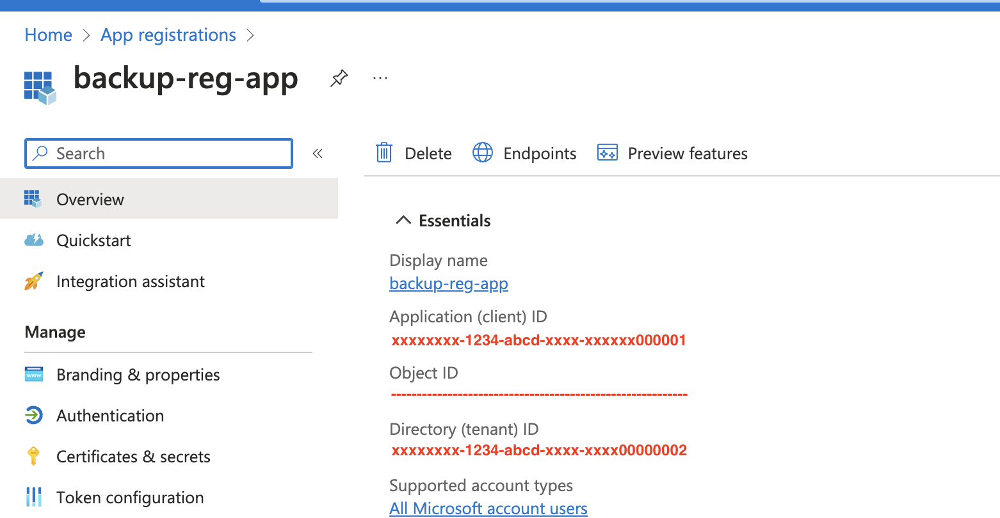
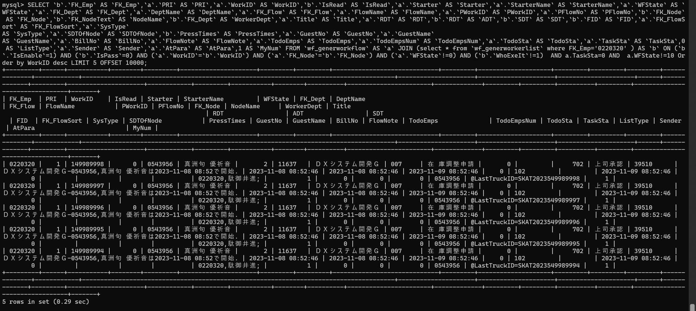
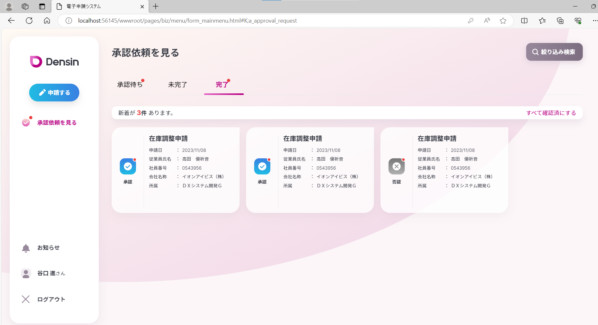
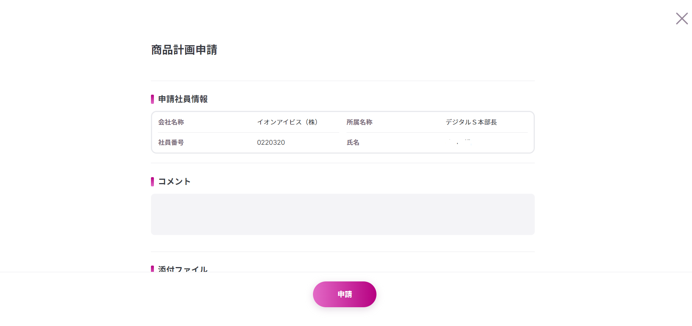
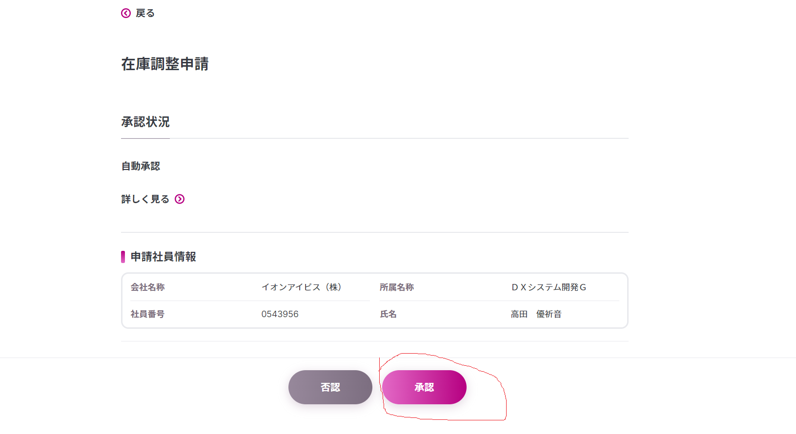

TiDB検証検証報告書
===========================
# 目次
- [TiDB検証目的](#TiDB検証目的)
- [TiDB検証概要](#TiDB検証概要)
- [TiDB検証環境準備](#TiDB検証環境準備)
- [TiDB検証テストデータ準備](#TiDB検証テストデータ準備)
- [TiDB運用とセッキュリティ検証](#TiDB運用とセッキュリティ検証)
- [TiDB性能検証](#TiDB性能検証)
- [DX環境でのTiDBインストール](#DX環境でのTiDBインストール)
## TiDB検証目的
Azureクラウドでのインストール、大量データ状態での運用手法、セッキュリテイ性、又利用性能などの観点からTiDBという製品がイオンのプロジェクトに適用かどうかを検証するのは今回の目的である。
## TiDB検証概要 
TiDB検証の詳細は下表のように纏めました。 
**結論としては、TiDBはAzureクラウドで運用しやすく、大量データを扱う場合でも性能に満足できる製品になります。**
| NO | 検証内容 | 評価結果 | 備考 |
| ---------- | -----------|-----------|-----------|
| 1| TiDBのAzureクラウドインストール検証 | ◎ | Azureクラウドにインストールしたが、DX環境のインストールはまだ検証していない |
| 2| TiDB運用とセッキュリティ検証 | ◎ |  |
| 2.1| Kubunetesバージョンアップ検証 | ◎ | DX基盤ではBlue/Green運用と称する |
| 2.2| データベースバックアップ検証 | ◎ |  |
| 2.3| TiDBバージョンアップ | ◎ |  |
| 2.4| データ保存テスク拡張検証 | ◎ |  |
| 2.5| 安全なDBアクセス方式の確立 | 〇 | サービスプリンシパル方式なし |
| 2.5.1| TiDB 安全な接続| ◎ | TiDB クライアント側の暗号化 |
| 2.5.2| Azure AD authentication | △ | Azure AD authentication サポート対象外 |
| 2.6| 多DBインスタンスの検証 | ◎ | インスタンス毎に細かくリリース振り分けできることを検証する |
| 3| TiDB性能検証 | 〇 | |
| 3.1| 大量データ参照 | ◎ | 三億行ほどのテーブルの参照 |
| 3.2| スケーリングからの性能影響| ◎ | スケーリングアウトとスケーリングアップからサービスに影響が少ない |
| 3.3| OrderBy | 〇 | OrderBy対応に懸念が残ったため(上順と下順の組合せ) 、一重まるを付けることに |


## TiDB検証環境準備

DX環境に検証する前にAzureのインターネット環境にTiDBをインストールし、性能とセッキュリテイ関連の検証を行った。インストール詳細は以下になります。

* Kubernetes　version： 1.25.11
※Blue/Greenプロセスを検証するためにインストール時に低いバージョンを選んだ
以下６Poolをインストール
* Tidb 2Pod
* Tikv 3Pod 各Pod１Ti　SSDテスクを付ける
* Pd    3Pod 
* Ticdc 3Pod
* Tiflash 3Pod
* Admin 1Pod


## TiDB検証テストデータ準備

### テストアプリ
CCFlowのワークフローシステム（SSFlow）のデータベースがSQL　ServerからTiDBに切り替え、テストアプリとして利用する
CCFlowエンジンなどを解析し、データベーステーブルにワークフローデータをインサートしてワークフローの承認関連動作や一覧などを正常に行えることを確認し、大容量テストデータの作成に入る。

### テストデータ
大容量テストデータ作成用のPythonプログラムを開発し、TiDBのAKS内テストデータ作成用POD（8Core,メモリ16Gi）、PODにテストデータ保存用ディスク１Tを付けることに、TiDB Lightningツールを使って1.5億件フロー（3業務フローにそれぞれ5000万件）データを導入した。
以上の1.5億件フローデータの容量は500Gi超になり、TiDBのセッキュリテイ性能を検証するためTiDB全体のボリュームが１Tiの状態でテストしたいと考えて、TiDBに新しいインスタンスを追加し、上記同じ500Giテストデータが新インスタンスにも導入した。

## TiDB運用とセッキュリティ検証
以下の順でKubunetesバージョンアップ、データベースバックアップ、 TiDBバージョンアップ、データ保存テスク拡張、安全なDBアクセス方式の確立、多DBインスタンスの検証を行いました。

### Kubunetesバージョンアップ
KubunetesバージョンアップはよくBlue/Green運用の形で対応していますが、TiDBでは順次にSlave NodeのKubenetesのバージョンアップ完了し、最後Master NodeのKubenetesのバージョンアップを行う形で作業を進めます。下記のダイナミック図のようにPOD別のKubenetesバージョンアップのプロセスより対応することとしています。
  

検証詳細プロセスは以下のようになります。

* Node、Podの現状を確認します。

```
kubectl get nodes
```
  
```
kubectl get tc -n tidb-cluster
```
  
```
kubectl get pod -n tidb-cluster -o wide
```
  

* control plane、PoolのK8Sバージョンを確認します。

```
az aks show --resource-group saas-core --name aeontidb --output table
```
  
```
az aks nodepool list --resource-group saas-core --cluster-name aeontidb --query "[].{Name:name,k8version:orchestratorVersion}" --output table
```
  

* control planeのK8Sバージョンアップを行います。
※バージョン1.25.11は1.26.10など限定バージョンにしかバージョンアップできないようになっていて、ほかのバージョン番号を指定されたら、エラーが発生します。
```
az aks upgrade --resource-group saas-core --name aeontidb --control-plane-only --no-wait --kubernetes-version 1.26.10
```
  

```
az aks show --resource-group saas-core --name aeontidb --output table
```
  

* 新しいtidb Poolを新規作成します。
```
az aks nodepool add --name newtidb --cluster-name aeontidb --resource-group saas-core --node-vm-size Standard_E8s_v4 --zones 1 2 3 --node-count 2 --labels dedicated=tidb --node-taints dedicated=tidb:NoSchedule
```
  
  
* PODを確認します。
```
kubectl get pod -n tidb-cluster -o wide
```
 

* 古いtidb Poolの紐づけを外します。
```
az aks nodepool update --resource-group saas-core --cluster-name aeontidb --name "tidb" --labels="" --node-taints=""
```
 

* tidbのPodを削除します（新Tidb Poolに紐づける新しいPODを自動起動する）。
```
kubectl delete pod basic-tidb-0 -n tidb-cluster
kubectl delete pod basic-tidb-1 -n tidb-cluster
```
 

* 古いtidb Poolを削除します。
```
az aks nodepool delete --name tidb --cluster-name aeontidb --resource-group saas-core
```
 


* Pd,tikvも同じように新規Pool,旧pool関連外し、POD削除などを行います、コマンドは以下になります。
```
az aks nodepool add --name newpd --cluster-name aeontidb --resource-group saas-core --node-vm-size Standard_F4s_v2 --zones 1 2 3 --node-count 3 --labels dedicated=pd --node-taints dedicated=pd:NoSchedule

az aks nodepool add --name newtikv --cluster-name aeontidb --resource-group saas-core --node-vm-size Standard_E8s_v4 --zones 1 2 3 --node-count 3 --labels dedicated=tikv --node-taints dedicated=tikv:NoSchedule

 az aks nodepool update --resource-group saas-core --cluster-name aeontidb --name "pd" --labels="" --node-taints=""
 az aks nodepool update --resource-group saas-core --cluster-name aeontidb --name "tikv" --labels="" --node-taints="“
kubectl delete pod basic-pd-0 -n tidb-cluster
kubectl delete pod basic-pd-1 -n tidb-cluster
kubectl delete pod basic-pd-2 -n tidb-cluster
kubectl delete pod basic-tikv-0 -n tidb-cluster
kubectl delete pod basic-tikv-1 -n tidb-cluster
kubectl delete pod basic-tikv-2 -n tidb-cluster
az aks nodepool delete --name pd --cluster-name aeontidb --resource-group saas-core
az aks nodepool delete --name tikv --cluster-name aeontidb --resource-group saas-core
```
* 新ticdc Poolを作成し、旧ticdc Poolを削除します。
```
az aks nodepool add --name newticdc --cluster-name aeontidb --resource-group saas-core --node-vm-size Standard_E16s_v4 --zones 1 2 3  --node-count 3 --labels dedicated=ticdc --node-taints dedicated=ticdc:NoSchedule
az aks nodepool delete --name ticdc --cluster-name aeontidb --resource-group saas-core
az aks nodepool list --cluster-name aeontidb --resource-group saas-core --output table
```
 

* Master PoolのKubenetesバージョンアップを行います。
```
az aks nodepool upgrade --resource-group saas-core --cluster-name aeontidb --name admin --no-wait --kubernetes-version 1.26.10
```
 

* テストアプリ画面でフローの承認などの作業をし、正常に動作できることが確認できました！
 
### TiDBバージョンアップ
#### バージョンアップ前の確認
* TiDBサービス確認
```
kubectl get service -n tidb-cluster
```


* バージョン確認

#### バージョンアップ実施

* バージョン設定


* バージョンアップ監視


#### バージョンアップ後の確認


### バックアップとリストア検証
#### 事前準備
* アプリの登録
```
tidb-on-aks$ az ad app create --display-name backup-reg-app
{
  "@odata.context": "https://graph.microsoft.com/v1.0/$metadata#applications/$entity",
  "addIns": [],
... ...
    "logoutUrl": null,
    "redirectUriSettings": [],
    "redirectUris": []
  }
}
```

* アプリのsecretの設定
```
tidb-on-aks$ az ad app list --display-name "backup-reg-app" | jq '.[0].appId'
"xxxxxxxx-1234-abcd-xxxx-xxxxxx000001"
tidb-on-aks$  az ad app credential reset --id "xxxxxxxx-1234-abcd-xxxx-xxxxxx000001" --append 
The output includes credentials that you must protect. Be sure that you do not include these credentials in your code or check the credentials into your source control. For more information, see https://aka.ms/azadsp-cli
{
  "appId": "xxxxxxxx-1234-abcd-xxxx-xxxxxx000001",
  "password": "XXxxQ~xxxxxxxxXXXX_~xxxxxxxxxxXXXXXXXX01",
  "tenant": "xxxxxxxx-1234-abcd-xxxx-xxxx00000002"
}
tidb-on-aks$ az ad app credential list --id "xxxxxxxx-1234-abcd-xxxx-xxxxxx000001"
[
  {
    "customKeyIdentifier": null,
    "displayName": null,
    "endDateTime": "2024-12-01T02:40:16Z",
    "hint": "VwR",
    "keyId": "yyyyyyyy-yyyy-yyyy-yyyy-yyyyyyyy0002",
    "secretText": null,
    "startDateTime": "2023-12-01T02:40:16Z"
  }
]
```

* プリンシパル作成
```
tidb-on-aks$ az ad sp create --id 01139ae6-58c7-4a7c-b360-fc8110e13fce
{
  "@odata.context": "https://graph.microsoft.com/v1.0/$metadata#servicePrincipals/$entity",
  "accountEnabled": true,
  "addIns": [],
  "alternativeNames": [],
  ... ...
  "verifiedPublisher": {
    "addedDateTime": null,
    "displayName": null,
    "verifiedPublisherId": null
  }
}
```
* 使用する変数
  変数名 | 例
  --- | ---
  アプリ名 | backup-reg-app
  secret ID | yyyyyyyy-yyyy-yyyy-yyyy-yyyyyyyy0002
  Value | VwRxQ~xxxxxxxxXXXX_~xxxxxxxxxxXXXXXXXX01
  appId(client id) | xxxxxxxx-1234-abcd-xxxx-xxxxxx000001
  tenant | xxxxxxxx-1234-abcd-xxxx-xxxx00000002
#### ストレージ準備
* Azure ストレージアカウント準備
```
tidb-on-aks$ export RESOURCE_GROUP=resource_name_to_deploy
tidb-on-aks$ az storage account create --name pingcapdbbackuptest --resource-group $RESOURCE_GROUP --allow-blob-public-access false --location "East US"
The public access to all blobs or containers in the storage account will be disallowed by default in the future, which means default value for --allow-blob-public-access is still null but will be equivalent to false.
{                         
  "accessTier": "Hot",          
  "allowBlobPublicAccess": false,
  "allowCrossTenantReplication": null,
  "allowSharedKeyAccess": null,
  ... ...
  "tags": {},
  "type": "Microsoft.Storage/storageAccounts"
}
```


* コンテナ準備
```
tidb-on-aks$ az storage container create -n dbbackup --account-name pingcapdbbackuqptest
{
  "created": true
}
```


* REGISTER APP権限付与
  リソース | ロール
  --- | ---
  ストレージアカウント | Storage Blob Data Contributor
  ストレージアカウント | Storage Queue Data Contributor
  コンテナ |	Contributor
  - ストレージアカウント権限付与
```
tidb-on-aks$ az role assignment create --assignee "xxxxxxxx-1234-abcd-xxxx-xxxxxx000001" --role "Storage Blob Data Contributor" --scope "/subscriptions/00000000-0000-0000-0000-000000000000/resourceGroups/$RESOUIRCE_GROUP/providers/Microsoft.Storage/storageAccounts/pingcapdbbackuptest"
{
  "condition": null,
  "conditionVersion": null,
  "createdBy": null,
  "createdOn": "2023-12-01T14:16:26.166195+00:00",
  "delegatedManagedIdentityResourceId": null,
  "description": null,
  "id": "/subscriptions/00000000-0000-0000-0000-000000000000/resourceGroups/$RESOURCE_GROUP/providers/Microsoft.Storage/storageAccounts/pingcapdbbackuptest/providers/Microsoft.Authorization/roleAssignments/22f1ac17-572c-4a57-a5cd-143b033f13ba",
  ... ...
}
tidb-on-aks$ az role assignment create --assignee "xxxxxxxx-1234-abcd-xxxx-xxxxxx000001" --role "Storage Queue Data Contributor" --scope "/subscriptions/00000000-0000-0000-0000-000000000000/resourceGroups/$RESOURCE_GROUP/providers/Microsoft.Storage/storageAccounts/pingcapdbbackuptest"
{
  "condition": null,
  "conditionVersion": null,
  "createdBy": null,
  "createdOn": "2023-12-01T14:21:06.453272+00:00",
  "delegatedManagedIdentityResourceId": null,
  "description": null,
  ... ...
}
```

  - コンテナ権限付与
```
tidb-on-aks$ az role assignment create --assignee "xxxxxxxx-1234-abcd-xxxx-xxxxxx000001" --role "Contributor" --scope "/subscriptions/00000000-0000-0000-0000-000000000000/resourceGroups/$RESOURCE_GROUP/providers/Microsoft.Storage/storageAccounts/pingcapdbbackuptest/blobServices/default/containers/dbbackup"
{
  "condition": null,
  "conditionVersion": null,
  "createdBy": null,
  "createdOn": "2023-12-01T08:29:10.402947+00:00",
  "delegatedManagedIdentityResourceId": null,
  "description": null,
  "id": "/subscriptions/00000000-0000-0000-0000-000000000000/resourceGroups/$RESOURCE_GROUP/providers/Microsoft.Storage/storageAccounts/pingcapdbbackuptest/blobServices/default/containers/dbbackup",
  ... ...
}
```

#### kubernetesにクレデンシャル格納
* kubernetesにクレデンシャル格納
```
tidb-on-aks$ export AZURE_STORAGE_ACCOUNT=pingcapdbbackuqptest
tidb-on-aks$ export AZURE_CLIENT_ID=xxxxxxxx-1234-abcd-xxxx-xxxxxx000001
tidb-on-aks$ export AD_TENANT_ID=xxxxxxxx-1234-abcd-xxxx-xxxx00000002
tidb-on-aks$ export SECRET_VALUE=VwRxQ~xxxxxxxxXXXX_~xxxxxxxxxxXXXXXXXX01
tidb-on-aks$ kubectl create namespace backup-test
tidb-on-aks$ kubectl create secret generic azblob-secret-ad --from-literal=AZURE_STORAGE_ACCOUNT=${AZURE_STORAGE_ACCOUNT} --from-literal=AZURE_CLIENT_ID=${AZURE_CLIENT_ID} --from-literal=AZURE_TENANT_ID=${AD_TENANT_ID} --from-literal=AZURE_CLIENT_SECRET=${SECRET_VALUE} --namespace=backup-test
tidb-on-aks$ kubectl create secret generic azblob-secret-ad --from-literal=AZURE_STORAGE_ACCOUNT=${AZURE_STORAGE_ACCOUNT} --from-literal=AZURE_CLIENT_ID=${AZURE_CLIENT_ID} --from-literal=AZURE_TENANT_ID=${AD_TENANT_ID} --from-literal=AZURE_CLIENT_SECRET=${SECRET_VALUE} --namespace=tidb-cluster
```
* サービスアカウント作成  
バックアップとリストア用のサービスアカウント作成。[リンクファイル](https://github.com/pingcap/tidb-operator/blob/v1.5.1/manifests/backup/backup-rbac.yaml)をダウンロードして、Kubernetesにサービスアカウントを作成すること。
```
tidb-on-aks$ more backup-rbac.yaml
---
kind: Role
apiVersion: rbac.authorization.k8s.io/v1
metadata:
  name: tidb-backup-manager
  labels:
    app.kubernetes.io/component: tidb-backup-manager
rules:
- apiGroups: [""]
  resources: ["events"]
  verbs: ["*"]
- apiGroups: ["pingcap.com"]
  resources: ["backups", "restores"]
  verbs: ["get", "watch", "list", "update"]

---
kind: ServiceAccount
apiVersion: v1
metadata:
  name: tidb-backup-manager

---
kind: RoleBinding
apiVersion: rbac.authorization.k8s.io/v1
metadata:
  name: tidb-backup-manager
  labels:
    app.kubernetes.io/component: tidb-backup-manager
subjects:
- kind: ServiceAccount
  name: tidb-backup-manager
roleRef:
  apiGroup: rbac.authorization.k8s.io
  kind: Role
  name: tidb-backup-manager

tidb-on-aks$ # The rbac is created after the namespace of backup-test is created
tidb-on-aks$ kubectl create -f backup-rbac.yaml -n backup-test
role.rbac.authorization.k8s.io/tidb-backup-manager created
serviceaccount/tidb-backup-manager created
rolebinding.rbac.authorization.k8s.io/tidb-backup-manager created

tidb-on-aks$ # The rbac is created after the namespace of restore-test is created
tidb-on-aks$ kubectl create -f backup-rbac.yaml -n restore-test
role.rbac.authorization.k8s.io/tidb-backup-manager created
serviceaccount/tidb-backup-manager created
rolebinding.rbac.authorization.k8s.io/tidb-backup-manager created
```
* クレデンシャルをTiDB Clusterにパッチ  
TiDBクラスターのTiKVノードからストレージアカウントへアクセスするために、ストレージアカウントのクレデンシャルをTiKVに環境変数としてパッチする。
```
tidb-on-aks$ kubectl exec jaytest-tikv-0 -n tidb-cluster  -- env | grep AZURE
tidb-on-aks$ # Confirmed that no AZURE variable is set in the TiKV pods
tidb-on-aks$ more /tmp/merge.json
{"spec":{"tikv":{"envFrom":[{"secretRef":{"name":"azblob-secret-ad"}}]}}}
tidb-on-aks$ kubectl patch tc jaytest001 -n tidb-cluster --type merge --patch-file /tmp/merge.json
tidbcluster.pingcap.com/jaytest001 patched
tidb-on-aks workstation$ kubectl exec jaytest-tikv-0 -n tidb-cluster  -- env | grep AZURE
AZURE_STORAGE_ACCOUNT=pingcapdbbackuptest
AZURE_TENANT_ID=xxxxxxxx-1234-abcd-xxxx-xxxx00000002
AZURE_CLIENT_ID=xxxxxxxx-1234-abcd-xxxx-xxxxxx000001
AZURE_CLIENT_SECRET=VwRxQ~xxxxxxxxXXXX_~xxxxxxxxxxXXXXXXXX01
```
#### 継続的アーカイブログ
下記のジョブで継続的アーカイブログを有効にする。
```
tidb-on-aks$ more /tmp/log-backup-azblob.yaml
---
apiVersion: pingcap.com/v1alpha1
kind: Backup
metadata:
  name: demo-log-backup-azblob
  namespace: backup-test
spec:
  backupMode: log
  br:
    cluster: jaytest001
    clusterNamespace: tidb-cluster
    sendCredToTikv: false
  azblob:
    secretName: azblob-secret-ad
    container: dbbackup
    prefix: pitr-log
    #accessTier: Hot
tidb-on-aks$ kubectl apply -f /tmp/log-backup-azblob.yaml -n backup-test
backup.pingcap.com/demo-log-backup-azblob created
tidb-on-aks$ kubectl get backup -n backup-test 
NAME                           TYPE   MODE       STATUS     BACKUPPATH                                 BACKUPSIZE   COMMITTS             LOGTRUNCATEUNTIL   TIMETAKEN   AGE
demo-log-backup-azblob                log        Running    azure://dbbackup/pitr-log/                              446043223075848194                                  36s
```
#### フルバックアップ
下記に作成したバックアップのジョブを利用して、フルデータベースのバックアップをストレージアカウントに取る。
```
tidb-on-aks workstation$ more /tmp/full-backup-azblob.yaml
---
apiVersion: pingcap.com/v1alpha1
kind: Backup
metadata:
  name: demo1-full-backup-azblob-001
  namespace: backup-test
spec:
  backupType: full
  br:
    cluster: jaytest001
    clusterNamespace: tidb-cluster
    sendCredToTikv: false
  azblob:
    secretName: azblob-secret-ad
    container: dbbackup
    prefix: full-backup-folder/001
    accessTier: Cool
tidb-on-aks$ kubectl apply -f /tmp/full-backup-azblob.yaml -n backup-test
backup.pingcap.com/demo1-full-backup-azblob-001 created
```

#### フルバックアップからのリストア
フルバックアップから新規TiDBクラスターにリストアする。リストア後のテーブルを確認すること。
```
tidb-on-aks$ kubectl create namespace restore-test
tidb-on-aks$ kubectl apply -f /tmp/backup-rbac.yaml -n restore-test
tidb-on-aks$ kubectl create secret generic azblob-secret-ad --from-literal=AZURE_STORAGE_ACCOUNT=${AZURE_STORAGE_ACCOUNT} --from-literal=AZURE_CLIENT_ID=${AZURE_CLIENT_ID} --from-literal=AZURE_TENANT_ID=${AD_TENANT_ID} --from-literal=AZURE_CLIENT_SECRET=${SECRET_VALUE} --namespace=restore-test
secret/azblob-secret-ad created
tidb-on-aks$ more /tmp/restore-full-azblob.yaml
---
apiVersion: pingcap.com/v1alpha1
kind: Restore
metadata:
  name: demo-restore-azblob
  namespace: restore-test
spec:
  br:
    cluster: jaytest001
    clusterNamespace: tidb-cluster
    sendCredToTikv: false
  azblob:
    secretName: azblob-secret-ad
    container: dbbackup
    prefix: full-backup-folder/001
tidb-on-aks$ kubectl apply -f /tmp/restore-full-azblob.yaml -n restore-test
tidb-on-aks$ kubectl get restore -n restore-test 
NAME                  STATUS     TIMETAKEN   COMMITTS             AGE
demo-restore-azblob   Complete   3s          446045655929454593   65m

MySQL [test]> show tables; 
+----------------+
| Tables_in_test |
+----------------+
| test01         |
+----------------+
1 row in set (0.002 sec)

MySQL [test]> select count(*) from test01; 
+----------+
| count(*) |
+----------+
|     2560 |
+----------+
1 row in set (0.007 sec)
```
#### PITR
フルバックアップと継続的アーカイブログからPITRを行う。
```
tidb-on-aks$ more /tmp/restore-point-azblob.yaml 
---
apiVersion: pingcap.com/v1alpha1
kind: Restore
metadata:
  name: demo-restore-azblob
  namespace: restore-test
spec:
  restoreMode: pitr
  br:
    cluster: jaytest001
    clusterNamespace: tidb-cluster
  azblob:
    secretName: azblob-secret-ad
    container: dbbackup
    prefix: full-backup-folder/001 
  pitrRestoredTs: "2023-12-03T01:32:00+09:00"
  pitrFullBackupStorageProvider:
    azblob:
      secretName: azblob-secret-ad
      container: dbbackup
      prefix: pitr-log
tidb-on-aks$ kubectl apply -f /tmp/restore-point-azblob.yaml -n restore-test 
restore.pingcap.com/demo-restore-azblob configured
```

### 柔軟なスケリング
* ノード数を3から6まで増加
```
workstation$ az aks nodepool scale --cluster-name jaytest001 --name newtikv --resource-group azure-jp-tech-team --node-count 6
... ...
workstation$ az aks nodepool show --cluster-name jaytest001 --name newtikv --resource-group azure-jp-tech-team
{                                                                                         
  "availabilityZones": [
    "1",                          
    "2",            
    "3"
  ],                           
  "count": 6,          
  "creationData": null,  
  "currentOrchestratorVersion": "1.25.11",
  ... ...
```
* TiKV スケールアウト
```
workstation$ more tidb-cluster.org
... ...
  tikv:
    baseImage: pingcap/tikv
    maxFailoverCount: 0
    replicas: 6
    requests:
      storage: "1024Gi"
    storageClassName: managed-csi
    config: {}
    nodeSelector:
      dedicated: jaytest001-tikv
    tolerations:
    - effect: NoSchedule
      key: dedicated
      operator: Equal
      value: jaytest001-tikv
    affinity:
      podAntiAffinity:
        requiredDuringSchedulingIgnoredDuringExecution:
        - labelSelector:
            matchExpressions:
            - key: app.kubernetes.io/component
              operator: In
              values:
              - tikv
          topologyKey: kubernetes.io/hostname
... ...
workstation$ kubectl get pods -n tidb-cluster
NAME                                    READY   STATUS    RESTARTS   AGE
jaytest001-discovery-85976b8d88-b6gfn   1/1     Running   0          141m
jaytest001-pd-0                         1/1     Running   0          141m
jaytest001-pd-1                         1/1     Running   0          141m
jaytest001-pd-2                         1/1     Running   0          141m
jaytest001-ticdc-0                      1/1     Running   0          139m
jaytest001-ticdc-1                      1/1     Running   0          139m
jaytest001-ticdc-2                      1/1     Running   0          139m
jaytest001-tidb-0                       2/2     Running   0          139m
jaytest001-tidb-1                       2/2     Running   0          139m
jaytest001-tikv-0                       1/1     Running   0          53m
jaytest001-tikv-1                       1/1     Running   0          50m
jaytest001-tikv-2                       1/1     Running   0          49m
workstation$ kubectl apply -f tidb-cluster.yaml -n tidb-cluster
tidbcluster.pingcap.com/jaytest001 configured
workstation$ kubectl get pods -n tidb-cluster
NAME                                    READY   STATUS              RESTARTS   AGE
jaytest001-discovery-85976b8d88-b6gfn   1/1     Running             0          142m
jaytest001-pd-0                         1/1     Running             0          142m
jaytest001-pd-1                         1/1     Running             0          142m
jaytest001-pd-2                         1/1     Running             0          142m
jaytest001-ticdc-0                      1/1     Running             0          141m
jaytest001-ticdc-1                      1/1     Running             0          141m
jaytest001-ticdc-2                      1/1     Running             0          141m
jaytest001-tidb-0                       2/2     Running             0          141m
jaytest001-tidb-1                       2/2     Running             0          141m
jaytest001-tikv-0                       1/1     Running             0          54m
jaytest001-tikv-1                       1/1     Running             0          52m
jaytest001-tikv-2                       1/1     Running             0          51m
jaytest001-tikv-3                       0/1     ContainerCreating   0          29s
jaytest001-tikv-4                       0/1     ContainerCreating   0          29s
jaytest001-tikv-5                       0/1     ContainerCreating   0          28s
```
* 増加したノードの確認
```
workstation$ kubectl get pods -o wide -n tidb-cluster
NAME                                    READY   STATUS    RESTARTS   AGE    IP            NODE                                NOMINATED NODE   READINESS GATES
jaytest001-discovery-85976b8d88-b6gfn   1/1     Running   0          143m   10.244.0.18   aks-agentpool-20070760-vmss000000   <none>           <none>
jaytest001-pd-0                         1/1     Running   0          143m   10.244.2.3    aks-pd-41925797-vmss000002          <none>           <none>
jaytest001-pd-1                         1/1     Running   0          143m   10.244.11.3   aks-pd-41925797-vmss000001          <none>           <none>
jaytest001-pd-2                         1/1     Running   0          143m   10.244.1.3    aks-pd-41925797-vmss000000          <none>           <none>
jaytest001-ticdc-0                      1/1     Running   0          141m   10.244.10.3   aks-ticdc-37156663-vmss000000       <none>           <none>
jaytest001-ticdc-1                      1/1     Running   0          141m   10.244.9.3    aks-ticdc-37156663-vmss000001       <none>           <none>
jaytest001-ticdc-2                      1/1     Running   0          141m   10.244.6.3    aks-ticdc-37156663-vmss000002       <none>           <none>
jaytest001-tidb-0                       2/2     Running   0          141m   10.244.7.3    aks-tidb-32471927-vmss000001        <none>           <none>
jaytest001-tidb-1                       2/2     Running   0          141m   10.244.5.3    aks-tidb-32471927-vmss000000        <none>           <none>
jaytest001-tikv-0                       1/1     Running   0          55m    10.244.14.2   aks-newtikv-12483745-vmss000001     <none>           <none>
jaytest001-tikv-1                       1/1     Running   0          52m    10.244.13.2   aks-newtikv-12483745-vmss000002     <none>           <none>
jaytest001-tikv-2                       1/1     Running   0          51m    10.244.12.2   aks-newtikv-12483745-vmss000000     <none>           <none>
jaytest001-tikv-3                       1/1     Running   0          71s    10.244.15.2   aks-newtikv-12483745-vmss000004     <none>           <none>
jaytest001-tikv-4                       1/1     Running   0          71s    10.244.16.2   aks-newtikv-12483745-vmss000005     <none>           <none>
jaytest001-tikv-5                       1/1     Running   0          70s    10.244.17.2   aks-newtikv-12483745-vmss000003     <none>           <none>
workstation$ kubectl get pv -n tidb-cluster
NAME                                       CAPACITY   ACCESS MODES   RECLAIM POLICY   STATUS   CLAIM                            STORAGECLASS   REASON   AGE
pvc-1b4b64b4-5477-47ef-8536-a17183b326af   10Gi       RWO            Retain           Bound    default/pd-jaytest001-pd-0       managed-csi             3h2m
pvc-1bfbd067-0e62-4841-97b8-ec842cc02a2f   1Ti        RWO            Retain           Bound    default/tikv-jaytest001-tikv-0   managed-csi             3h1m
pvc-4d62fbf7-4848-47d8-ad9d-0cf0cb5381e0   10Gi       RWO            Retain           Bound    default/pd-jaytest001-pd-1       managed-csi             3h2m
pvc-57fd1573-885b-4fc4-982c-2e272c718f2d   1Ti        RWO            Retain           Bound    default/tikv-jaytest001-tikv-4   managed-csi             9m58s
pvc-b752de53-34de-4ce9-96c9-c37035b13188   1Ti        RWO            Retain           Bound    default/tikv-jaytest001-tikv-2   managed-csi             3h1m
pvc-b75edfa4-eb6f-4272-8ef3-c74df7b24903   1Ti        RWO            Retain           Bound    default/tikv-jaytest001-tikv-3   managed-csi             9m58s
pvc-d61381c0-b96c-4627-98a0-93995d532c55   1Ti        RWO            Retain           Bound    default/tikv-jaytest001-tikv-1   managed-csi             3h1m
pvc-e448f349-f842-4033-8424-2ce437f1aa82   1Ti        RWO            Retain           Bound    default/tikv-jaytest001-tikv-5   managed-csi             9m58s
pvc-fca71a43-bfbd-48a4-a8fe-a6f71efc74de   10Gi       RWO            Retain           Bound    default/pd-jaytest001-pd-2       managed-csi             3h2m
workstation$ kubectl get pvc -n tidb-cluster
NAME                     STATUS   VOLUME                                     CAPACITY   ACCESS MODES   STORAGECLASS   AGE
pd-jaytest001-pd-0       Bound    pvc-1b4b64b4-5477-47ef-8536-a17183b326af   10Gi       RWO            managed-csi    3h2m
pd-jaytest001-pd-1       Bound    pvc-4d62fbf7-4848-47d8-ad9d-0cf0cb5381e0   10Gi       RWO            managed-csi    3h2m
pd-jaytest001-pd-2       Bound    pvc-fca71a43-bfbd-48a4-a8fe-a6f71efc74de   10Gi       RWO            managed-csi    3h2m
tikv-jaytest001-tikv-0   Bound    pvc-1bfbd067-0e62-4841-97b8-ec842cc02a2f   1Ti        RWO            managed-csi    3h2m
tikv-jaytest001-tikv-1   Bound    pvc-d61381c0-b96c-4627-98a0-93995d532c55   1Ti        RWO            managed-csi    3h2m
tikv-jaytest001-tikv-2   Bound    pvc-b752de53-34de-4ce9-96c9-c37035b13188   1Ti        RWO            managed-csi    3h2m
tikv-jaytest001-tikv-3   Bound    pvc-b75edfa4-eb6f-4272-8ef3-c74df7b24903   1Ti        RWO            managed-csi    10m
tikv-jaytest001-tikv-4   Bound    pvc-57fd1573-885b-4fc4-982c-2e272c718f2d   1Ti        RWO            managed-csi    10m
tikv-jaytest001-tikv-5   Bound    pvc-e448f349-f842-4033-8424-2ce437f1aa82   1Ti        RWO            managed-csi    10m
```
### オンラインディスク拡張
* TiKVディスクサイズ確認
```
workstation$ kubectl get pvc -n tidb-cluster
NAME                     STATUS   VOLUME                                     CAPACITY   ACCESS MODES   STORAGECLASS   AGE
pd-jaytest001-pd-0       Bound    pvc-1b4b64b4-5477-47ef-8536-a17183b326af   10Gi       RWO            managed-csi    87m
pd-jaytest001-pd-1       Bound    pvc-4d62fbf7-4848-47d8-ad9d-0cf0cb5381e0   10Gi       RWO            managed-csi    87m
pd-jaytest001-pd-2       Bound    pvc-fca71a43-bfbd-48a4-a8fe-a6f71efc74de   10Gi       RWO            managed-csi    87m
tikv-jaytest001-tikv-0   Bound    pvc-1bfbd067-0e62-4841-97b8-ec842cc02a2f   512Gi      RWO            managed-csi    86m
tikv-jaytest001-tikv-1   Bound    pvc-d61381c0-b96c-4627-98a0-93995d532c55   512Gi      RWO            managed-csi    86m
tikv-jaytest001-tikv-2   Bound    pvc-b752de53-34de-4ce9-96c9-c37035b13188   512Gi      RWO            managed-csi    86m
```

* KubernetesのPVCに対するパッチを行う
```
workstation$ kubectl patch pvc tikv-jaytest001-tikv-0 --type merge --patch '{"spec": {"resources": {"requests": {"storage": "1024Gi"}}}}'
workstation$ kubectl patch pvc tikv-jaytest001-tikv-1 --type merge --patch '{"spec": {"resources": {"requests": {"storage": "1024Gi"}}}}'
workstation$ kubectl patch pvc tikv-jaytest001-tikv-2 --type merge --patch '{"spec": {"resources": {"requests": {"storage": "1024Gi"}}}}'
workstation$ $ kubectl get pv 
NAME                                       CAPACITY   ACCESS MODES   RECLAIM POLICY   STATUS   CLAIM                            STORAGECLASS   REASON   AGE
pvc-1b4b64b4-5477-47ef-8536-a17183b326af   10Gi       RWO            Retain           Bound    default/pd-jaytest001-pd-0       managed-csi             90m
pvc-1bfbd067-0e62-4841-97b8-ec842cc02a2f   512Gi      RWO            Retain           Bound    default/tikv-jaytest001-tikv-0   managed-csi             89m
pvc-4d62fbf7-4848-47d8-ad9d-0cf0cb5381e0   10Gi       RWO            Retain           Bound    default/pd-jaytest001-pd-1       managed-csi             90m
pvc-b752de53-34de-4ce9-96c9-c37035b13188   512Gi      RWO            Retain           Bound    default/tikv-jaytest001-tikv-2   managed-csi             89m
pvc-d61381c0-b96c-4627-98a0-93995d532c55   512Gi      RWO            Retain           Bound    default/tikv-jaytest001-tikv-1   managed-csi             89m
pvc-fca71a43-bfbd-48a4-a8fe-a6f71efc74de   10Gi       RWO            Retain           Bound    default/pd-jaytest001-pd-2       managed-csi             90m
```

* 拡張したディスクの確認
```
workstation$ # wait 10 minutes
workstation$ kubectl get pvc
NAME                     STATUS   VOLUME                                     CAPACITY   ACCESS MODES   STORAGECLASS   AGE
pd-jaytest001-pd-0       Bound    pvc-1b4b64b4-5477-47ef-8536-a17183b326af   10Gi       RWO            managed-csi    93m
pd-jaytest001-pd-1       Bound    pvc-4d62fbf7-4848-47d8-ad9d-0cf0cb5381e0   10Gi       RWO            managed-csi    93m
pd-jaytest001-pd-2       Bound    pvc-fca71a43-bfbd-48a4-a8fe-a6f71efc74de   10Gi       RWO            managed-csi    93m
tikv-jaytest001-tikv-0   Bound    pvc-1bfbd067-0e62-4841-97b8-ec842cc02a2f   1Ti        RWO            managed-csi    93m
tikv-jaytest001-tikv-1   Bound    pvc-d61381c0-b96c-4627-98a0-93995d532c55   1Ti        RWO            managed-csi    93m
tikv-jaytest001-tikv-2   Bound    pvc-b752de53-34de-4ce9-96c9-c37035b13188   1Ti        RWO            managed-csi    93m

workstation$ kubectl exec -it jaytest001-tikv-0 -- sh 
/ # df -h 
Filesystem                Size      Used Available Use% Mounted on
... ...
/dev/sdb               1007.4G      5.2G   1002.2G   1% /var/lib/tikv
... ...
```
## TiDB性能検証 
### 性能検証概要
TiDB検証テストデータ準備(#TiDB検証テストデータ準備)の節にも紹介したように三つのワークフローにそれぞれ5000万件のフローテストデータを作成しました。以下の各テーブルのデータボリューム詳細情報です。
| NO | テーブル | データ件数 | 備考 |
| ---------- | -----------|-----------|-----------|
| 1| tt_wf_merchandise_plan | 5000万 | 仕入計画申請フローのトランザクションテーブル |
| 2| nd1track | 5000万 | 仕入計画申請フローのトラックテーブル |
| 3| tt_wf_arrival_returns | 5000万 | 入荷返品申請フローのトランザクションテーブル |
| 4| nd5track | 5000万 | 入荷返品申請フローのトラックテーブル |
| 5| tt_wf_stock_adjustment | 5000万 | 在庫調整申請フローのトランザクションテーブル |
| 6| nd7track | 5000万 | 在庫調整申請フローのトラックテーブル |
| 7| wf_generworkflow | 15000万 | ワークフローの申請状態情報管理テーブル |
| 8| wf_generworkerlist | 30000万 | ワークフロー状態変更履歴管理テーブル |
| 9| tt_wf_order_number | 15000万 | 業務申請番号採番管理テーブル |

以下は単テーブルCount性能検証、複数テーブルCount性能検証、多テーブル一覧検索性能検証、フロー新規（Insert）性能検証、フロー承認（Update）性能検証の順で性能検証を行う

### 単テーブルCount性能検証
wf_generworkerlistのCount検証
```
select count(*) from wf_generworkerlist;
```
 
tt_wf_merchandise_planのプライベートキー（Oid）を対象にCount検証
```
select count(oid) from tt_wf_merchandise_plan;
```
 
### 複数テーブルCount性能検証
テーブルwf_generworkflowとwf_generworkerlist以下のように結合後のCount検証
```
SELECT count(*) FROM `wf_generworkflow` AS `a` JOIN (select * from `wf_generworkerlist` where FK_Emp='0220320' ) AS `b` ON (`b`.`IsEnable`=1) AND (`b`.`IsPass`=0) AND (`a`.`WorkID`=`b`.`WorkID`) AND (`a`.`FK_Node`=`b`.`FK_Node`) AND (`a`.`WFState`!=0) AND (`b`.`WhoExeIt`!=1)  AND a.TaskSta=0 AND  a.WFState!=10;
```
```
SELECT count(*) FROM `wf_generworkflow` AS `a` JOIN (select * from `wf_generworkerlist` where FK_Emp='0210069' )
AS `b` ON (`b`.`IsEnable`=1) AND (`b`.`IsPass`=0) AND (`a`.`WorkID`=`b`.`WorkID`) AND (`a`.`FK_Node`=`b`.`FK_Node`) AND
(`a`.`WFState`!=0) AND (`b`.`WhoExeIt`!=1)  AND a.TaskSta=0 AND  a.WFState!=10;
```
 

### 多テーブル一覧検索性能検証
* 上記複数テーブルCount性能検証と同じ結合条件で10000目レコードから5件レコードを抽出した場合の性能検証(Order by にWordIDだけにする)
```
SELECT `b`.`FK_Emp` AS `FK_Emp`,`a`.`PRI` AS `PRI`,`a`.`WorkID` AS `WorkID`,`b`.`IsRead` AS `IsRead`,`a`.`Starter` AS `Starter`,`a`.`StarterName` AS `StarterName`,`a`.`WFState` AS `WFState`,`a`.`FK_Dept` AS `FK_Dept`,`a`.`DeptName` AS `DeptName`,`a`.`FK_Flow` AS `FK_Flow`,`a`.`FlowName` AS `FlowName`,`a`.`PWorkID` AS `PWorkID`,`a`.`PFlowNo` AS `PFlowNo`,`b`.`FK_Node` AS `FK_Node`,`b`.`FK_NodeText` AS `NodeName`,`b`.`FK_Dept` AS `WorkerDept`,`a`.`Title` AS `Title`,`a`.`RDT` AS `RDT`,`b`.`RDT` AS `ADT`,`b`.`SDT` AS `SDT`,`b`.`FID` AS `FID`,`a`.`FK_FlowSort` AS `FK_FlowSort`,`a`.`SysType` AS `SysType`,`a`.`SDTOfNode` AS `SDTOfNode`,`b`.`PressTimes` AS `PressTimes`,`a`.`GuestNo` AS `GuestNo`,`a`.`GuestName` AS `GuestName`,`a`.`BillNo` AS `BillNo`,`a`.`FlowNote` AS `FlowNote`,`a`.`TodoEmps` AS `TodoEmps`,`a`.`TodoEmpsNum` AS `TodoEmpsNum`,`a`.`TodoSta` AS `TodoSta`,`a`.`TaskSta` AS `TaskSta`,0 AS `ListType`,`a`.`Sender` AS `Sender`,`a`.`AtPara` AS `AtPara`,1 AS `MyNum` FROM `wf_generworkflow` AS `a` JOIN wf_generworkerlist AS `b` ON (`b`.`IsEnable`=1) AND (`b`.`IsPass`=0) AND (`a`.`WorkID`=`b`.`WorkID`) AND (`a`.`FK_Node`=`b`.`FK_Node`) AND (`a`.`WFState`!=0) AND (`b`.`WhoExeIt`!=1)  AND a.TaskSta=0 AND  a.WFState!=10 Order by WorkID desc LIMIT 5 OFFSET 10000
```
 

* Order by にa.WordID desc ,b.FK_Emp ascにする場合
```
SELECT `b`.`FK_Emp` AS `FK_Emp`,`a`.`PRI` AS `PRI`,`a`.`WorkID` AS `WorkID`,`b`.`IsRead` AS `IsRead`,`a`.`Starter` AS `Starter`,`a`.`StarterName` AS `StarterName`,`a`.`WFState` AS `WFState`,`a`.`FK_Dept` AS `FK_Dept`,`a`.`DeptName` AS `DeptName`,`a`.`FK_Flow` AS `FK_Flow`,`a`.`FlowName` AS `FlowName`,`a`.`PWorkID` AS `PWorkID`,`a`.`PFlowNo` AS `PFlowNo`,`b`.`FK_Node` AS `FK_Node`,`b`.`FK_NodeText` AS `NodeName`,`b`.`FK_Dept` AS `WorkerDept`,`a`.`Title` AS `Title`,`a`.`RDT` AS `RDT`,`b`.`RDT` AS `ADT`,`b`.`SDT` AS `SDT`,`b`.`FID` AS `FID`,`a`.`FK_FlowSort` AS `FK_FlowSort`,`a`.`SysType` AS `SysType`,`a`.`SDTOfNode` AS `SDTOfNode`,`b`.`PressTimes` AS `PressTimes`,`a`.`GuestNo` AS `GuestNo`,`a`.`GuestName` AS `GuestName`,`a`.`BillNo` AS `BillNo`,`a`.`FlowNote` AS `FlowNote`,`a`.`TodoEmps` AS `TodoEmps`,`a`.`TodoEmpsNum` AS `TodoEmpsNum`,`a`.`TodoSta` AS `TodoSta`,`a`.`TaskSta` AS `TaskSta`,0 AS `ListType`,`a`.`Sender` AS `Sender`,`a`.`AtPara` AS `AtPara`,1 AS `MyNum` FROM `wf_generworkflow` AS `a` JOIN wf_generworkerlist AS `b` ON (`b`.`IsEnable`=1) AND (`b`.`IsPass`=0) AND (`a`.`WorkID`=`b`.`WorkID`) AND (`a`.`FK_Node`=`b`.`FK_Node`) AND (`a`.`WFState`!=0) AND (`b`.`WhoExeIt`!=1)  AND a.TaskSta=0 AND  a.WFState!=10 Order by WorkID desc,FK_Emp asc LIMIT 5 OFFSET 10000;
```
下図のように「Out Of Memory」エラーが発生しました。
 
* 降順(desc)、昇順(asc)を外しても、同じく「Out Of Memory」エラーが発生しました。
 
懸念：結合後違うテーブル、違うカラムでOrder Byできないのです。

* 同じテーブルでもOrder byに複数カラム、かつ降順(desc)、昇順(asc)を自由に組合せで検索する
wf_generworkerlistテーブルに以下のインデックス追加済みです。
** workid
** fk_emp
** workid,fk_emp
** fk_emp,workid

```
select * from wf_generworkerlist order by workid desc,fk_emp asc limit 5 offset 10000;
```
 
```
select * from wf_generworkerlist order by fk_emp asc,workid desc limit 5 offset 0;
```
 
上記いずれも１分以上がかかりました。


懸念：TiDBでは同じテーブルでもOrder byにカラム（カラム組合せインデックス追加済みであることを前提）の降順(desc)、昇順(asc)を自由に組合せすることができないのです。
以下のようにdescやascを外したら、エラーなく検索できる
* 降順(desc)、昇順(asc)を外して、又は全部昇順(asc)で検索を行う（インデックスには昇順(asc)がデフォルトである）
```
select * from wf_generworkerlist order by workid ,fk_emp  limit 5 offset 0;
```
 
```
select * from wf_generworkerlist order by fk_emp asc,workid asc limit 5 offset 0;
```
 
上記いずれも0.02秒以内が完了しました。

以下のテストアプリ側に最もアクセスする画面ーー承認待ち/未完了/完了一覧画面である<br/>
※以下はテストデータを表示されている画面イメージです。三画面データが同じタイミングでデータ抽出を行う
* 承認待ち一覧
 
* 完了一覧
 

上記の一覧に使う検索文は以下のようものです。
```
SELECT A.* ,F.*,OU.ORDER_NUMBER FROM (SELECT `b`.`FK_Emp` AS `FK_Emp`,`a`.`PRI` AS `PRI`,`a`.`WorkID` AS `WorkID`,`b`.`IsRead` AS `IsRead`,`a`.`Starter` AS `Starter`,`a`.`StarterName` AS `StarterName`,`a`.`WFState` AS `WFState`,`a`.`FK_Dept` AS `FK_Dept`,`a`.`DeptName` AS `DeptName`,`a`.`FK_Flow` AS `FK_Flow`,`a`.`FlowName` AS `FlowName`,`a`.`PWorkID` AS `PWorkID`,`a`.`PFlowNo` AS `PFlowNo`,`b`.`FK_Node` AS `FK_Node`,`b`.`FK_NodeText` AS `NodeName`,`b`.`FK_Dept` AS `WorkerDept`,`a`.`Title` AS `Title`,`a`.`RDT` AS `RDT`,`b`.`RDT` AS `ADT`,`b`.`SDT` AS `SDT`,`b`.`FID` AS `FID`,`a`.`FK_FlowSort` AS `FK_FlowSort`,`a`.`SysType` AS `SysType`,`a`.`SDTOfNode` AS `SDTOfNode`,`b`.`PressTimes` AS `PressTimes`,`a`.`GuestNo` AS `GuestNo`,`a`.`GuestName` AS `GuestName`,`a`.`BillNo` AS `BillNo`,`a`.`FlowNote` AS `FlowNote`,`a`.`TodoEmps` AS `TodoEmps`,`a`.`TodoEmpsNum` AS `TodoEmpsNum`,`a`.`TodoSta` AS `TodoSta`,`a`.`TaskSta` AS `TaskSta`,0 AS `ListType`,`a`.`Sender` AS `Sender`,`a`.`AtPara` AS `AtPara`,1 AS `MyNum` FROM `wf_generworkflow` AS `a` JOIN (select * from `wf_generworkerlist` where FK_Emp='0220320' ) AS `b` ON (`b`.`IsEnable`=1) AND (`b`.`IsPass`=0) AND (`a`.`WorkID`=`b`.`WorkID`) AND (`a`.`FK_Node`=`b`.`FK_Node`) AND (`a`.`WFState`!=0) AND (`b`.`WhoExeIt`!=1)  AND a.TaskSta=0 AND  a.WFState!=10) A left join WF_Flow AS F on A.FK_Flow =F.No LEFT JOIN TT_WF_ORDER_NUMBER AS OU ON A.WorkID = OU.OID WHERE  A.WFState!=10 ORDER BY  A.WorkID DESC LIMIT 12 OFFSET 0;
```
 
テストアプリのデータベース検索SQL文に色々チューニングした結果、検索（承認待ち、未完了、完了三つの検索を行う）に必要な時間が１秒以内で完成でき、ウェブ画面の描画時間を含めて20秒前後三つのリストを表示できました<br>
<B>億単位のデータを扱うシステムに対して、MySQL、SQL Serverなどのデータベースで対応できない場面に対して、SQL文チューニングに少し工夫が必要であるものの、TiDBは対応できるようであることを検証できました。</B>

### フロー新規（Insert）性能検証
下記の「商品計画申請」リンクを押下されたら、tt_wf_merchandise_plan、nd1track、wf_generworkflow、wf_generworkerlist、tt_wf_order_numberにそれぞれ一レコードを追加し、リンク押下から画面表示するまで10秒以内で完成でき、申請データなしの場合の反応時間との差がなしである。
 
 
### フロー承認（Update）性能検証
下記の承認ボタンを押下したら、tt_wf_merchandise_plan、nd1track、wf_generworkflow、wf_generworkerlistなど四つのテーブルにそれぞれレコード更新を行い、承認ボタン押下から承認完了まで10秒以内完了でき、申請データなしの場合の反応時間と差がなしである
 
 
### TiDB導入時データ検索チューニングについて
* ビューの使用に控え目に
ビューが絶対に利用できないのではありませんが、全てのRDBにはビューがテーブルのようにレコード集的な存在ではなく、ただのSQL文マクロ変数（変数名はビュー名である）みたいなものである認識を持たせてください。<br>
ビューのSQL文はよくチューニングしていないと検索性能が出ません。又ビューを利用するとチューニングしずく、ビューのSQL文を合わせてチューニングすることを強く推薦する。
* 検索条件、OrderByに表しているカラム、カラムの組合せに対してインデックスの追加は必須になる
あまり沢山なインデックスを追加したら、データベース全体の性能に影響しかねないため、必要不可欠インデックスの追加を原則としする。<br>
※TiDB7.0(2024年5月リリース予定)からインデックス追加補助金ツールを提供する予定です。
* OrderByの性能劣化のためについて
複数テーブルの違いクラムでOrderByに使う場合、又同じテーブルに複数クラムで降順（インデックスにデフォルトで降順）以外でOrderByに設定する場合は性能劣化が発生しました。TiDBは将来のバージョン（2025年以降）で対応する予定ですが、上記の場合は現状プログラムのロジック修正にしかないのです。
* SQLチューニングについて
なるべくデカルト積を最小の方向でテーブル間の結合を行い、なるべくデカルト積の縮小率が高い順で検索条件、結合条件を組み合わせろう。
* 検索処理、集計処理（SUMなどの処理）にテーブルレコード全体20％以上を及ぶ場合はTiFlashの利用を推薦する。
